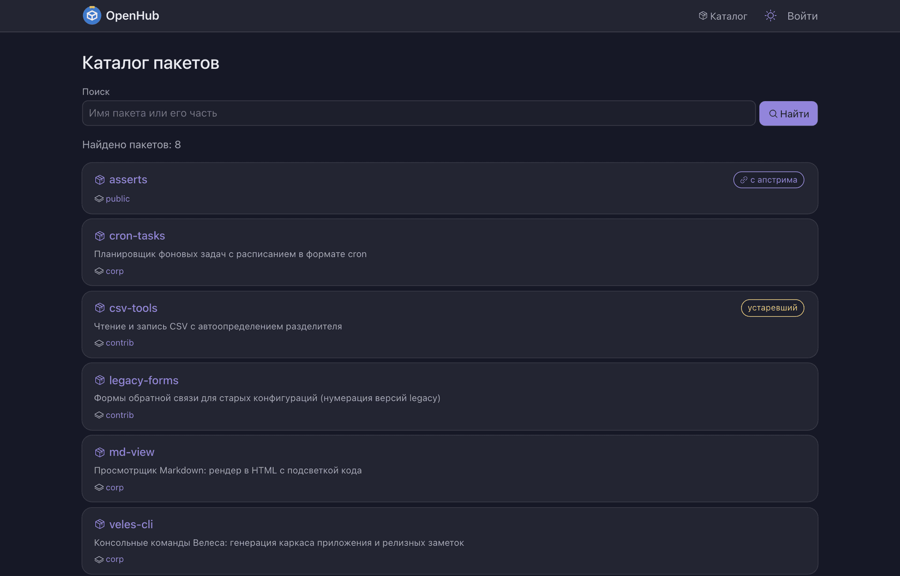
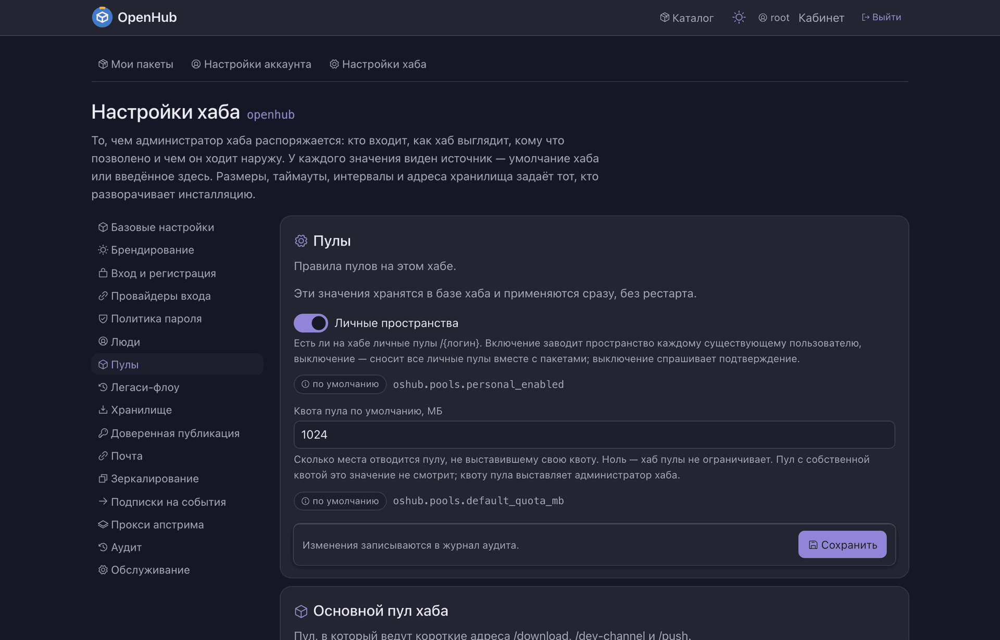
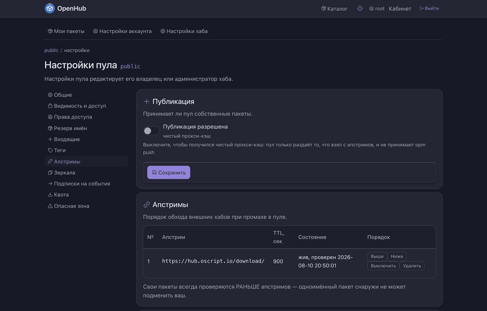
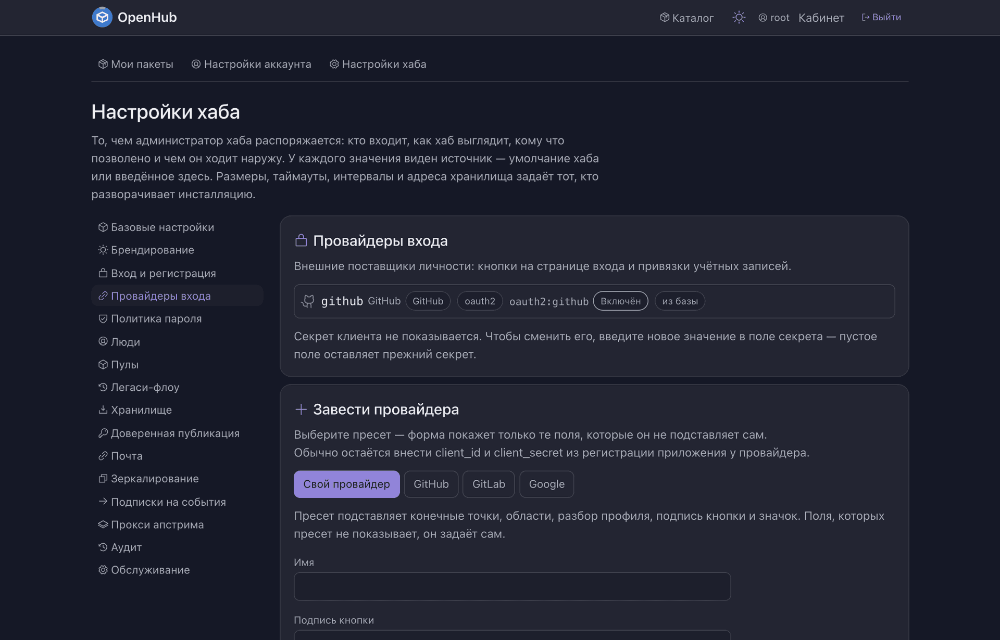
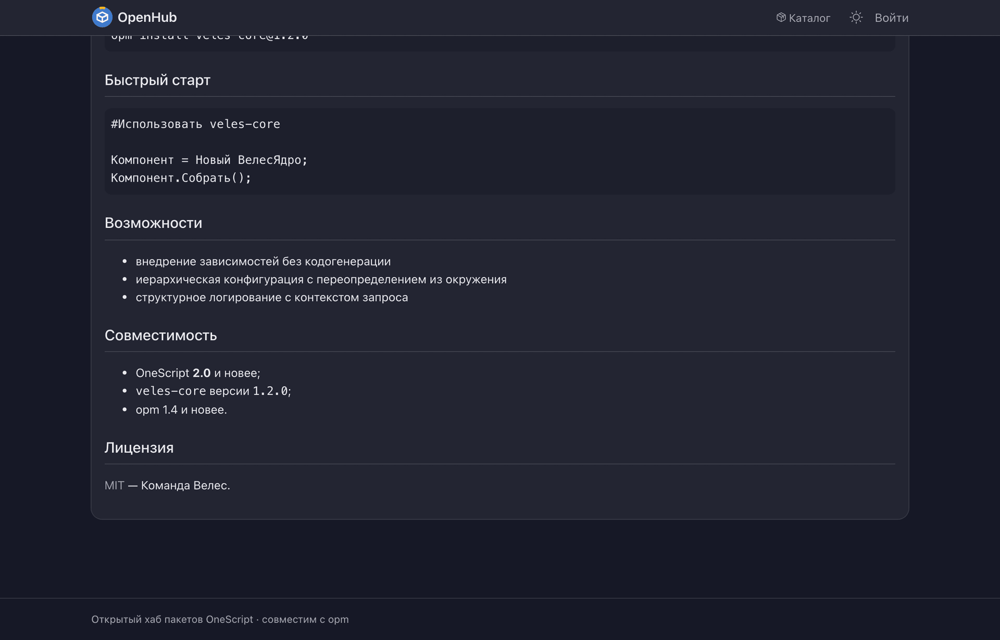
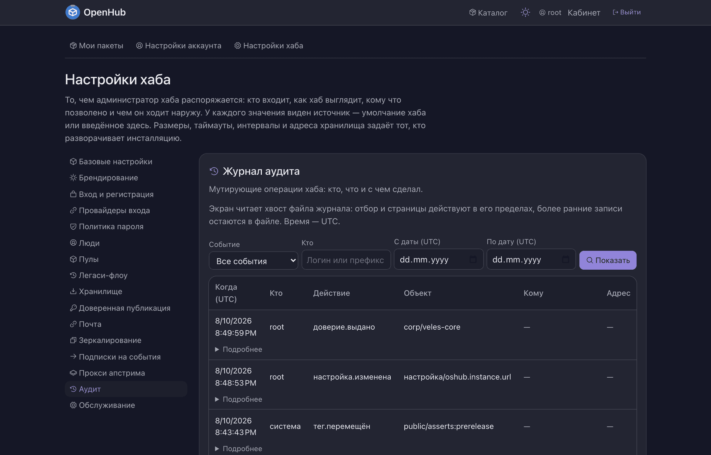

<div align="center">


# OpenHub

**Открытый хаб пакетов OneScript.** Свой реестр библиотек — с каталогом, правами,
кэширующим прокси перед публичным хабом и публикацией из CI.
Работает со **стоковым `opm`**: ни плагинов, ни патчей клиенту не нужно.

</div>



---

## Что это

`opm` умеет ставить пакеты с сервера — но сервер этот один на всех, и положить туда
внутреннюю библиотеку компании нельзя. OpenHub — этот самый сервер, который вы
поднимаете себе: командой или контейнером, на ноутбуке или в кластере.

Что он вам даёт:

- **место для своих пакетов.** Внутренние библиотеки лежат у вас, ставятся тем же
  `opm install`, видны в каталоге с описанием и версиями;
- **прокси перед публичным хабом.** Пакет, которого у вас нет, хаб сам скачает
  с `hub.oscript.io` и оставит у себя — сборка перестаёт зависеть от чужой доступности;
- **порядок в доступе.** Кто читает, кто публикует, кто заводит пулы — роли на пулах
  и пакетах, вход через ваш корпоративный SSO, токены с рамками вместо общего пароля;
- **публикацию из CI без секрета в репозитории** — по короткоживущему id-token,
  как это делает PyPI.

Стек: чистый OneScript + [ОСень](https://github.com/autumn-library/autumn) +
[winow](https://github.com/autumn-library/winow). Внешних служб не требует: из коробки
работает на файловой базе и файловом хранилище.

---

## Попробовать за минуту

```bash
docker run -d --name openhub -p 3333:3333 \
  -v openhub-data:/var/lib/openhub \
  segateekb/openhub
```

Откройте <http://localhost:3333> — хаб встретит мастером первого запуска и попросит
завести администратора.

> На Apple Silicon добавьте `--platform linux/amd64 -e DOTNET_EnableWriteXorExecute=0`:
> без первого образ не скачается, без второго qemu ломает JIT .NET.

Дальше — [«Как развернуть свой хаб»](docs/развёртывание.md): установка пакетом, файл
настроек, первый пользователь, первый пул и первая публикация, шаг за шагом.

---

## Что умеет

### Пулы — пространства имён хаба

Пакеты живут не «в хабе», а в конкретном пуле. Пул — это адрес, видимость, квота,
права и (если нужно) внешний источник.

| Тип пула | Адрес пакета | Для чего |
| --- | --- | --- |
| основной | `/{пакет}` | общий реестр инсталляции, цель `opm push` по умолчанию |
| личный | `/{логин}/{пакет}` | личное пространство, заводится вместе с учёткой |
| произвольный | `/{пул}/{пакет}` | команда, приватный контур, зеркало чужого хаба |

Пул делается приватным целиком, закрывается для публикации не удаляясь, получает квоту
места и права — пользователям и группам.



### Кэширующий прокси и зеркала

Пулу задаётся упорядоченный список **источников** — адресов выдачи чужих хабов. Чего нет
у себя, хаб берёт оттуда и **оставляет в пуле**: второй раз наружу он уже не пойдёт.
Отдельно от этого работает **зеркалирование** — перенос пачкой по расписанию, чтобы
пакеты лежали до того, как их спросят.

Свои публикации из пула не вытесняются никогда — место уступает только привезённое.

📖 [Кэширующий прокси и зеркала](docs/кэширующий-прокси.md)



### Теги — каналы обновления

Тег помечает набор версий, а `пакет@тег` отдаёт максимальную из них. Из коробки у пакета
два тега: `stable` (релизы) и `prerelease` (с предрелизным суффиксом). Состав тега либо
набирается руками, либо задаётся правилом по версиям — и тогда новая подходящая версия
попадает под тег сама.

📖 [Теги и каналы обновления](docs/теги-и-каналы.md)


### Вход: пароль, внешний провайдер, токены

Учётка одна, способов входа несколько. Провайдер (GitHub, GitLab, Google или любой
OIDC) заводится из интерфейса пресетом — без правки конфигов и перезапуска. Группы из
IdP раскладываются в группы хаба и сверяются на каждом входе. Парольный вход можно
выключить целиком.

`opm` ходит по токену, а не по паролю: `opm login --browser` показывает короткий код,
вы подтверждаете вход в браузере.

📖 [Как настроить вход через провайдера](docs/вход-через-провайдера.md)



### Доверенная публикация из CI

То же, что в других экосистемах зовут *trusted publishing*: конвейер не хранит токен
хаба, а предъявляет короткоживущий id-token своего провайдера. Хаб проверяет подпись
и сверяет репозиторий с рефом. Утекать из секретов репозитория становится нечему.

📖 [Как настроить доверенную публикацию](docs/доверенная-публикация.md)


### Каталог, карточка пакета, версии

Поиск по неточному слову, README пакета как описание, готовая команда установки
с кнопкой «копировать», версии — и тегами, и плоским списком, зависимости в обе стороны,
счётчик скачиваний.



### Эксплуатация

Журнал аудита на каждую мутацию, пробы `/health` и `/ready` для оркестратора,
трассировка OpenTelemetry, HTTP API `/api/v1` на всё, что есть в интерфейсе,
вебхуки и подписки на события.



---

## Статьи

| Статья | О чём |
| --- | --- |
| [Как развернуть свой хаб](docs/развёртывание.md) | от `opm install openhub` до первой опубликованной версии |
| [Вход через провайдера](docs/вход-через-провайдера.md) | OIDC-пресеты, автозаведение учёток, группы из IdP, выключение паролей |
| [Доверенная публикация](docs/доверенная-публикация.md) | публикация из GitHub Actions и GitLab CI без долгоживущего токена |
| [Кэширующий прокси](docs/кэширующий-прокси.md) | источники пула, кэш, квоты, зеркалирование по расписанию |
| [Теги и каналы](docs/теги-и-каналы.md) | `stable`, `prerelease`, свои каналы, правила и основной тег |

Эксплуатационная часть — [сборка и запуск образа](docker/README.md).
Разработка самого хаба — [docs/разработка.md](docs/разработка.md).

---

## Совместимость с `opm`

Хаб говорит на протоколе выдачи и публикации `opm` — клиент не патчится и не заменяется.

```bash
opm login hub.example.ru/public --browser   # токен через подтверждение в браузере
opm build .
opm push hub.example.ru/public мойпакет-1.0.0.ospx
opm install hub.example.ru/public/мойпакет
```

Адресная форма команд требует `opm` 1.7+. Клиент постарше подключается записью
в `opm.cfg` — готовую запись хаб печатает прямо на странице пакета.

Беспрефиксные адреса старых хабов (`/download/`, `/push`, `/dev-channel/`,
`/pools/{пул}/download/`) — **вечные алиасы**: конфигурации, написанные до переезда
адресов под `/api/v1`, работают без правок.

---

## Лицензия

[MIT](LICENSE).
