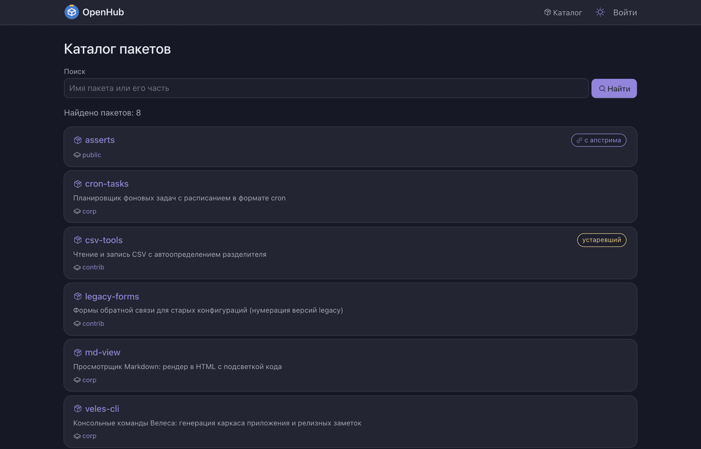
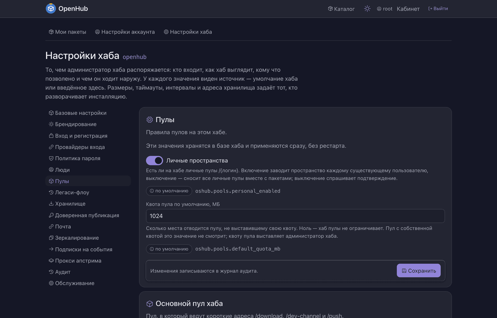
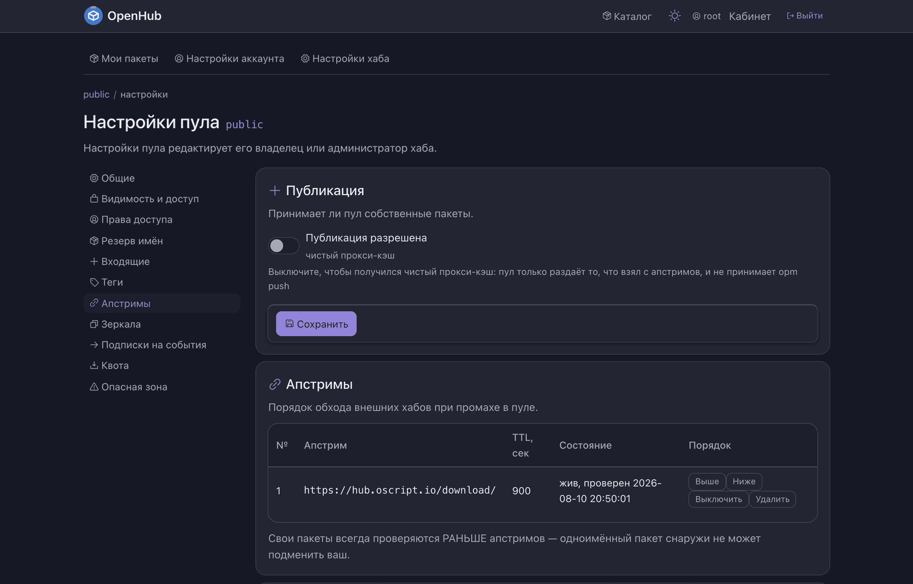
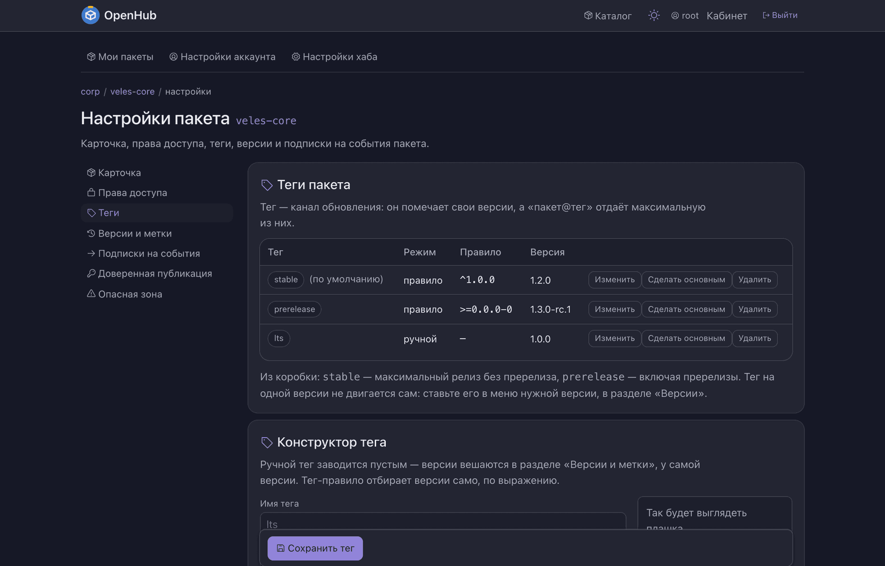
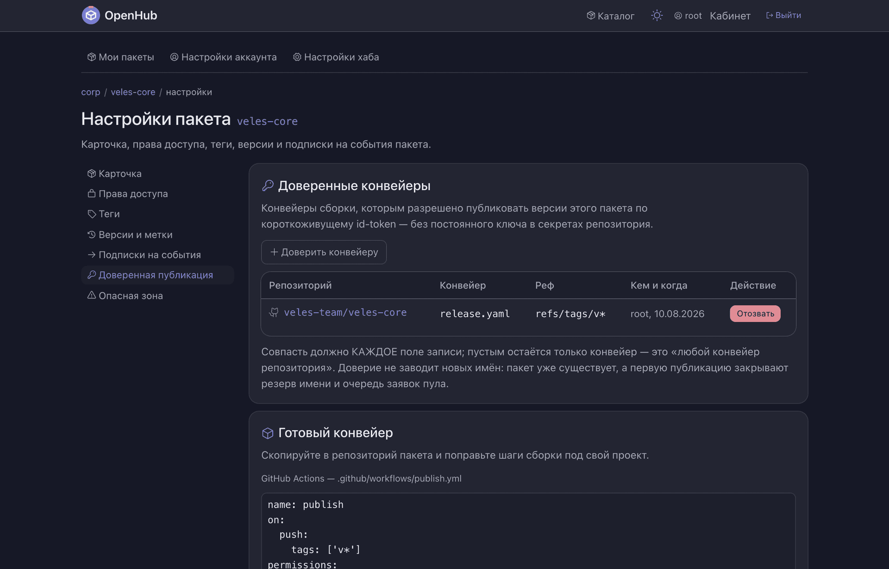
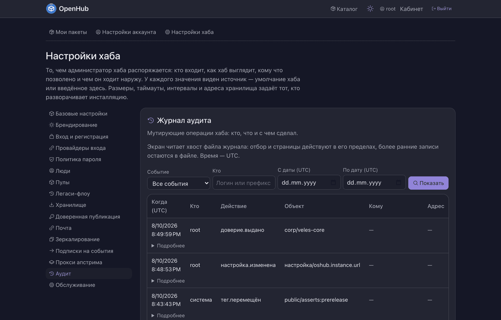

<div align="center">


# OpenHub

**Открытый хаб пакетов OneScript.** Свой реестр библиотек — с каталогом, правами,
кэширующим прокси перед публичным хабом и публикацией из CI.
Работает со **стоковым `opm`**: ни плагинов, ни патчей клиенту не нужно.

</div>



---

## Что это

Сервер пакетов для `opm`, который поднимают у себя: командой или контейнером, на ноутбуке
или в кластере. Для команд и компаний, которым нужно:

- **место для своих пакетов** — внутренние библиотеки ставятся тем же `opm install`
  и видны в каталоге с описанием и версиями;
- **прокси перед публичным хабом** — пакет, которого нет у себя, хаб скачивает
  с `hub.oscript.io` и оставляет у себя; сборка не зависит от чужой доступности;
- **порядок в доступе** — роли на пулах и пакетах, вход через корпоративный SSO, токены
  с рамками вместо общего пароля;
- **публикация из CI без секрета в репозитории** — по короткоживущему id-token,
  как в PyPI.

Стек: OneScript, [ОСень](https://github.com/autumn-library/autumn),
[winow](https://github.com/autumn-library/winow). Из коробки работает на файловой базе
и файловом хранилище, без внешних служб.

---

## Быстрый старт

```bash
docker run -d --name openhub -p 3333:3333 \
  -v openhub-data:/var/lib/openhub \
  segateekb/openhub
```

<http://localhost:3333> откроет мастер первого запуска: он заводит администратора.
На Apple Silicon — с флагами `--platform linux/amd64 -e DOTNET_EnableWriteXorExecute=0`.

Установка пакетом, файл настроек, первый пул и первая публикация —
[«Развёртывание»](docs/развёртывание.md).

---

## Возможности

### Пулы

Пакеты живут в пуле. Пул — это адрес, видимость, квота, права и, если нужно, внешний
источник.

| Тип пула | Цель для `opm` | Страница пакета | Для чего |
| --- | --- | --- | --- |
| основной | `{пакет}` | `/pools/{пул}/packages/{пакет}` | общий реестр инсталляции, цель `opm push` по умолчанию |
| личный | `{хост}/{логин}/{пакет}` | `/pools/{логин}/packages/{пакет}` | личное пространство, заводится вместе с учёткой |
| произвольный | `{хост}/{пул}/{пакет}` | `/pools/{пул}/packages/{пакет}` | команда, приватный контур, зеркало чужого хаба |

Страницы пула и пакета живут под `/pools`, поэтому имя пула, логина и пакета с адресами
хаба не пересекается. Пул делается приватным, закрывается для публикации без удаления,
получает квоту места и права — пользователям и группам.



### Кэширующий прокси и зеркала

Пулу задаётся упорядоченный список **источников** — адресов выдачи чужих хабов. Чего нет
у себя, хаб берёт оттуда и оставляет в пуле. **Зеркало** переносит набор пакетов
по расписанию, до первого запроса; в **режиме переноса** привезённые версии становятся
своими — так переезжают с другого хаба. Свои публикации из пула не вытесняются:
место уступает только привезённое.

📖 [Кэширующий прокси и зеркала](docs/кэширующий-прокси.md)



### Теги — каналы обновления

Тег помечает набор версий, `пакет@тег` отдаёт максимальную из них. Каналы `stable`,
`prerelease` и `develop` заводит кнопка в настройках пакета или сам пул для новых пакетов.
Состав тега набирается руками либо задаётся правилом по версиям.

📖 [Теги и каналы обновления](docs/теги-и-каналы.md)



### Вход: пароль, внешний провайдер, токены

Учётка одна, способов входа несколько. Провайдер (GitHub, GitLab, Google или любой OIDC)
заводится из интерфейса пресетом, без перезапуска. Группы из IdP раскладываются в группы
хаба и сверяются на каждом входе. Парольный вход выключается целиком. `opm` ходит
по токену доступа, выпущенному в кабинете.

📖 [Вход через провайдера](docs/вход-через-провайдера.md)


### Доверенная публикация из CI

*Trusted publishing*: конвейер не хранит токен хаба, а предъявляет короткоживущий id-token
своего провайдера (GitHub Actions, GitLab CI). Хаб проверяет подпись и сверяет репозиторий
и реф.

📖 [Доверенная публикация](docs/доверенная-публикация.md)



### Каталог и карточка пакета

Поиск по неточному слову, README пакета как описание, команда установки с кнопкой
«копировать», версии тегами и плоским списком, зависимости в обе стороны, счётчик скачиваний.
`.ospx` скачивается файлом со страницы и ставится командой `opm install -f <файл>`.


### Эксплуатация

Журнал аудита на каждое изменение, пробы `/health` и `/ready`, трассы, метрики и логи
OpenTelemetry, вебхуки и подписки на события, HTTP API `/api/v1` с описанием OpenAPI.

📖 [Эксплуатация](docs/эксплуатация.md) · [HTTP API](docs/http-api.md)



---

## Совместимость с `opm`

Хаб говорит на протоколе выдачи и публикации `opm`.

**Выпущенный `opm`** подключается записью в `opm.cfg`: готовую запись хаб печатает
на странице пакета. Если `opm` ходит к хабу без настройки клиента, настройка хаба
«opm знает этот хаб по умолчанию» снимает эту подсказку с пакетов основного публичного пула.

**Адресную форму команд** и вход через браузер понимает `opm` из
[oscript-library/opm#275](https://github.com/oscript-library/opm/pull/275):

```bash
opm login hub.example.ru/public --browser   # токен через подтверждение в браузере
opm build .
opm push --hub hub.example.ru/public мойпакет-1.0.0.ospx
opm install hub.example.ru/public/мойпакет
```

Беспрефиксные адреса выдачи и публикации (`/download/`, `/push`, `/dev-channel/`,
`/pools/{пул}/download/`) отвечают наравне с `/api/v1`: `opm.cfg`, написанный для обычного
хаба, подходит без правок.

---

## Документация

Все статьи — [docs/README.md](docs/README.md). Чаще всего нужны:
[развёртывание](docs/развёртывание.md), [настройки](docs/настройки.md),
[образ Docker](docker/README.md), [разработка](docs/разработка.md).

## Лицензия

[MIT](LICENSE).
