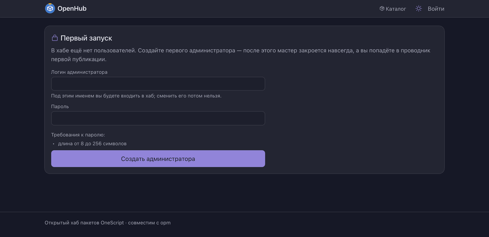

# Образ OpenHub

Здесь лежит всё, чем хаб собирается и запускается в контейнере.

| Файл | Что делает |
| --- | --- |
| [`Dockerfile`](Dockerfile) | описание образа; контекст сборки — корень репозитория |
| [`Dockerfile.dockerignore`](Dockerfile.dockerignore) | что попадает в контекст: `.ospx`, `packagedef` и распаковщик |
| [`образ.sh`](образ.sh) | собирает пакет и образ, по `--push` публикует |
| [`compose.yaml`](compose.yaml) | стенд с MinIO — проверить работу на S3 |

## Собрать

```bash
docker/образ.sh                    # segateekb/openhub:<версия> локально
docker/образ.sh --push             # собрать и опубликовать
docker/образ.sh --push my/openhub  # другой репозиторий
```

Версия берётся только из `packagedef`: ею помечаются файл `.ospx`, тег образа и метки OCI,
её же хаб отдаёт в `GET /health`. Сборка сверяет все носители версии между собой и падает,
если они разошлись, — руками версия не пишется нигде. Образ собирается под `linux/amd64`:
базовый `evilbeaver/onescript` других платформ не публикует.

## Запустить

Контейнер самодостаточен: ни S3, ни внешней базы данных не нужно.

```bash
docker run --rm -p 3333:3333 -v openhub-data:/var/lib/openhub segateekb/openhub
```

Хаб отвечает на <http://localhost:3333>, первого администратора заводит мастер на `/setup`.
Артефакты, база SQLite и журнал аудита лежат в `/var/lib/openhub`; том обязателен — без него
данные не переживут пересоздание контейнера.



*Так выглядит свежий хаб сразу после `docker run`.*

Стенд с MinIO целиком — `docker compose -f docker/compose.yaml up`.

> **На Apple Silicon нужны два флага.** Без `--platform linux/amd64` образ не скачается
> (`no matching manifest for linux/arm64/v8`), без `-e DOTNET_EnableWriteXorExecute=0`
> эмуляция ломает JIT .NET и любая библиотека падает с `NullReferenceException`.
> В образ вторая переменная не зашита: на настоящем amd64 она только вредит.
> В `compose.yaml` стоят обе.

## Настроить

Три источника значений, по убыванию приоритета: переменные окружения `OSHUB_*`, затем файл
`autumn-properties.json`, затем умолчания в коде. Файл приезжает внутри пакета и монтируется
поверх своим — `-v ./autumn-properties.json:/opt/openhub/autumn-properties.json:ro`, — причём
заменяет приехавший целиком, а не дополняет. Берите за основу
[`../autumn-properties.json`](../autumn-properties.json): там перечислены все настройки,
а имя переменной окружения выводится из имени настройки.

В образе зашиты только три переменные — те, что являются фактом контейнера, а не выбором
оператора:

| Переменная | Значение |
| --- | --- |
| `OSHUB_STORAGE_ROOT` | `/var/lib/openhub` |
| `OSHUB_DB_CONNECTOR` | `КоннекторSQLite` |
| `OSHUB_DB_CONNECTION` | `Data Source=/var/lib/openhub/openhub.db` |

Хранилище по умолчанию файловое, S3 включается переменными:

```bash
docker run --rm -p 3333:3333 -v openhub-data:/var/lib/openhub \
  -e OSHUB_STORAGE_BACKEND=s3 \
  -e OSHUB_STORAGE_S3_ENDPOINT=https://s3.example.com \
  -e OSHUB_STORAGE_S3_BUCKET=openhub \
  -e OSHUB_STORAGE_S3_ACCESS_KEY_FILE=/run/secrets/s3_access \
  -e OSHUB_STORAGE_S3_SECRET_KEY_FILE=/run/secrets/s3_secret \
  segateekb/openhub
```

> Ключи доступа читаются только из окружения — значением или через `*_FILE` — и в
> `autumn-properties.json` не кладутся.
>
> Эндпоинт S3 обязан слушать стандартный порт, 80 или 443: библиотека `oint` подписывает
> заголовок `Host` без порта, и на `:9000` сервер ответит `403 SignatureDoesNotMatch`.
> Поэтому у MinIO в `compose.yaml` стоит `--address ":80"`.

## Наружу — только за обратным прокси

Хаб принимает соединения по открытому HTTP; настроек шифрования у него нет. TLS терминирует
обратный прокси, там же настраиваются сжатие и ограничение темпа запросов. Порт самого хаба
слушает локальный адрес или сеть контейнеров.

## Пробы оркестратора

| Адрес | Что значит |
| --- | --- |
| `GET /health` | живость; отдаёт версию хаба |
| `GET /ready` | готовность; до конца старта отвечает 503 |
