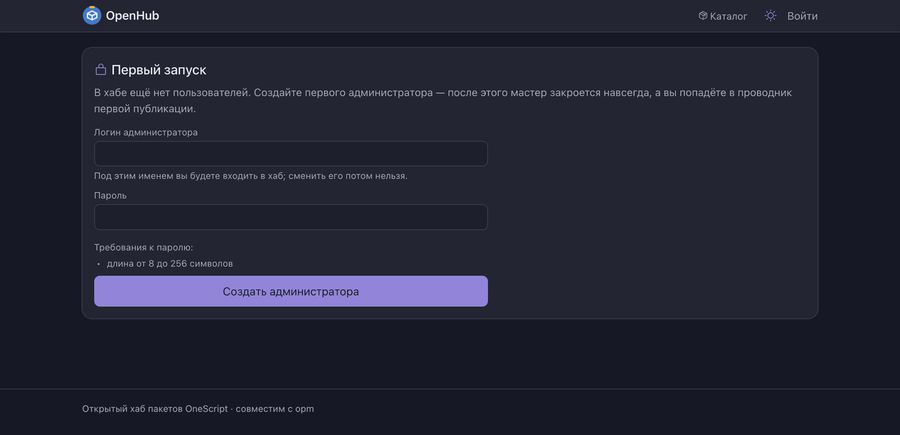

# Образ OpenHub

Сборка и запуск хаба в контейнере.

| Файл | Что это |
| --- | --- |
| [`Dockerfile`](Dockerfile) | описание образа; контекст сборки — корень репозитория |
| [`Dockerfile.dockerignore`](Dockerfile.dockerignore) | контекст сборки: только `openhub-*.ospx` |
| [`образ.sh`](образ.sh) | собирает пакет и образ, по `--push` публикует |
| [`compose.yaml`](compose.yaml) | тестовый стенд: хаб, MinIO и стенд наблюдаемости |
| [`наблюдаемость/`](наблюдаемость) | стенд наблюдаемости — [README](наблюдаемость/README.md) |

Комплект для сервера — [`../deploy/`](../deploy): хаб и PostgreSQL одним `compose.yaml`.

## Собрать

```bash
docker/образ.sh                    # segateekb/openhub:<версия> локально
docker/образ.sh --push             # собрать и опубликовать
docker/образ.sh --push my/openhub  # другой репозиторий
```

- Версия берётся из `packagedef`: ею помечаются `.ospx`, теги образа `<версия>` и `latest`
  и метки OCI. Хаб читает её из `packagedef` внутри пакета и отдаёт в `GET /health`.
- Платформа — `linux/amd64`: базовый образ других не публикует.
- База — официальный образ `evilbeaver/onescript` (Ubuntu, .NET, рантайм в `/var/oscript`).
  Тег выпуска задаёт `ARG ONESCRIPT_IMAGE` в `Dockerfile`; он не ниже `.ВерсияСреды`
  из `packagedef`. Точный образ закрепляется дайджестом:
  `evilbeaver/onescript:<тег>@sha256:<дайджест>`. Рантайм под тегом показывает
  `docker run --rm --entrypoint oscript evilbeaver/onescript:<тег> -version`.
- Пакет ставится из файла (`opm install -f … -s`): зависимости едут внутри `.ospx` —
  это `oscript_modules` рабочего дерева как есть, из хаба в образ ничего не ставится.
- Зависимости кладёт в `oscript_modules` команда `opm install -l`. Сборку форка `oint` ставят
  до неё из файла ([разработка](../docs/разработка.md#собрать-и-запустить)): в хабе этой версии нет.
- Перед `--push` скрипт сверяет версии `oint` и `autumn-cache` в `oscript_modules/<библиотека>/opm-metadata.xml`
  с `.ЗависитОт` в `packagedef` и при расхождении отказывает; проверочная сборка идёт дальше
  с предупреждением.
- Сети сборке нужно три адреса: Docker Hub (базовый образ), `hub.oscript.io`
  (`opm update opm`; обновлённый `opm` остаётся в образе), `archive.ubuntu.com` (`curl` для пробы).
- В корне репозитория не должно лежать `openhub-*.ospx` других версий — скрипт остановится.

## Запустить

```bash
docker run --rm -p 3333:3333 -v openhub-data:/var/lib/openhub segateekb/openhub
```

Хаб отвечает на <http://localhost:3333>, первого администратора заводит мастер на `/setup`.
База SQLite, файлы пакетов и журнал аудита лежат в томе `/var/lib/openhub`; без тома данные
не переживут пересоздание контейнера.



| Что | Значение |
| --- | --- |
| порт | `3333` |
| пользователь | `openhub`, uid и gid `10001` |
| каталог приложения | `/opt/openhub` |
| том данных | `/var/lib/openhub` |
| пояс времени | UTC (`TZ=UTC`): SQLite хранит даты в поясе процесса |

В шелле контейнера (`docker exec -it <контейнер> bash`) работает `opm install`: пользователь
хаба владеет `/var/oscript/lib` и `/usr/local/bin`. Рантайм в `/var/oscript/bin` принадлежит root.

> **Apple Silicon:** `--platform linux/amd64 -e DOTNET_EnableWriteXorExecute=0`. Без первого
> флага образ не скачается (`no matching manifest for linux/arm64/v8`), без второго эмуляция
> ломает JIT .NET (`NullReferenceException`). В образ переменная не зашита: на amd64 она
> не нужна.

## Настроить

Своего файла настроек в образе нет — контейнер работает на переменных и умолчаниях. Файл
монтируется так: `-v ./autumn-properties.json:/opt/openhub/autumn-properties.json:ro`;
основа — [`../deploy/autumn-properties.json`](../deploy/autumn-properties.json). Ключи,
переменные и их порядок — [справочник настроек](../docs/настройки.md).

### Переменные образа

| Переменная | Значение |
| --- | --- |
| `OSHUB_STORAGE_ROOT` | `/var/lib/openhub` |
| `OSHUB_DB_CONNECTOR` | `КоннекторSQLite` |
| `OSHUB_DB_CONNECTION` | `Data Source=/var/lib/openhub/openhub.db` |

Переменная сильнее файла, поэтому другую базу задают переменными — `OSHUB_DB_CONNECTOR`
и `OSHUB_DB_CONNECTION` либо родными именами autumn-data
([база данных](../docs/настройки.md#база-данных)).

### S3

```bash
docker run --rm -p 3333:3333 -v openhub-data:/var/lib/openhub \
  -e OSHUB_STORAGE_BACKEND=s3 \
  -e OSHUB_STORAGE_S3_ENDPOINT=https://s3.example.com \
  -e OSHUB_STORAGE_S3_BUCKET=openhub \
  -e OSHUB_STORAGE_S3_ACCESS__KEY__FILE=/run/secrets/s3_access \
  -e OSHUB_STORAGE_S3_SECRET__KEY__FILE=/run/secrets/s3_secret \
  segateekb/openhub
```

Остальные ключи хранилища и кэш артефактов — [хранилище пакетов](../docs/настройки.md#хранилище-пакетов).

## Пробы

В образ зашит `HEALTHCHECK`: `curl` на `/ready` раз в 30 с, первые 120 с старта в счёт
не идут, три неудачи подряд — `unhealthy`. `docker ps` показывает состояние без настройки.
В [`../deploy/compose.yaml`](../deploy/compose.yaml) та же проба выписана явно. Что значат
ответы `/ready` и `/health` — [пробы](../docs/эксплуатация.md#пробы).

## Тестовый стенд

```bash
docker compose -f docker/compose.yaml up -d      # хаб :3333, MinIO (консоль :9001), наблюдаемость
docker compose -f docker/compose.yaml up -d \
  --no-deps minio minio-init openhub             # только хаб и S3
docker compose -f docker/compose.yaml down -v    # снести вместе с данными
```

Стенд тестовый: пароли MinIO в открытую, Grafana пускает анонима администратором. Сервис
`openhub` зависит от коллектора; с `--no-deps` стенд наблюдаемости не поднимается, и хаб
на старте сообщает о недоступном коллекторе, продолжая работать. Стенд наблюдаемости —
[наблюдаемость/README.md](наблюдаемость/README.md).
