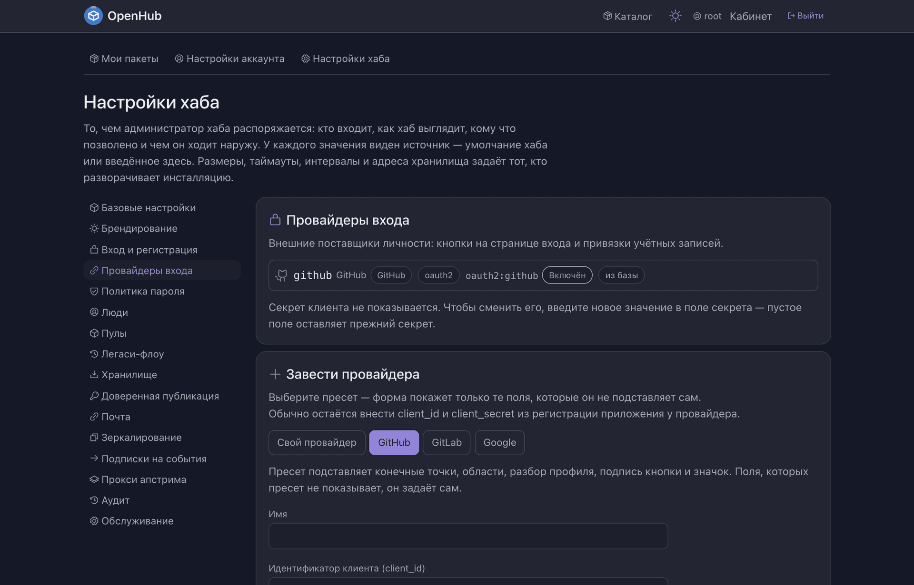
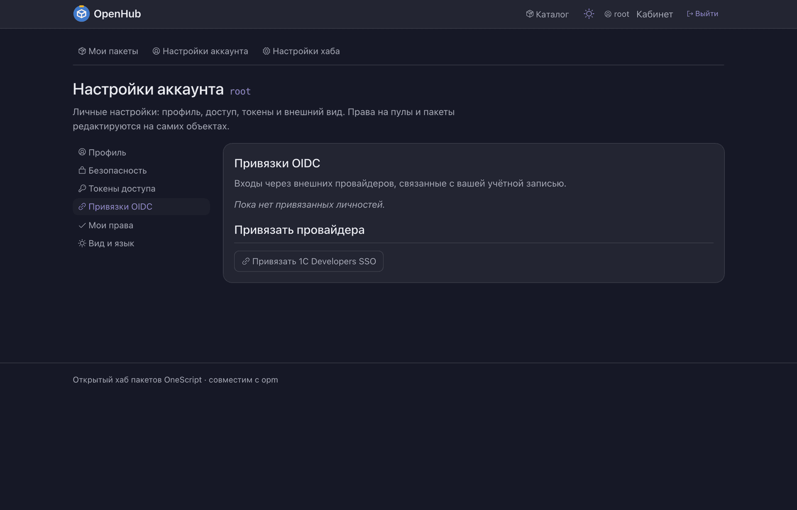
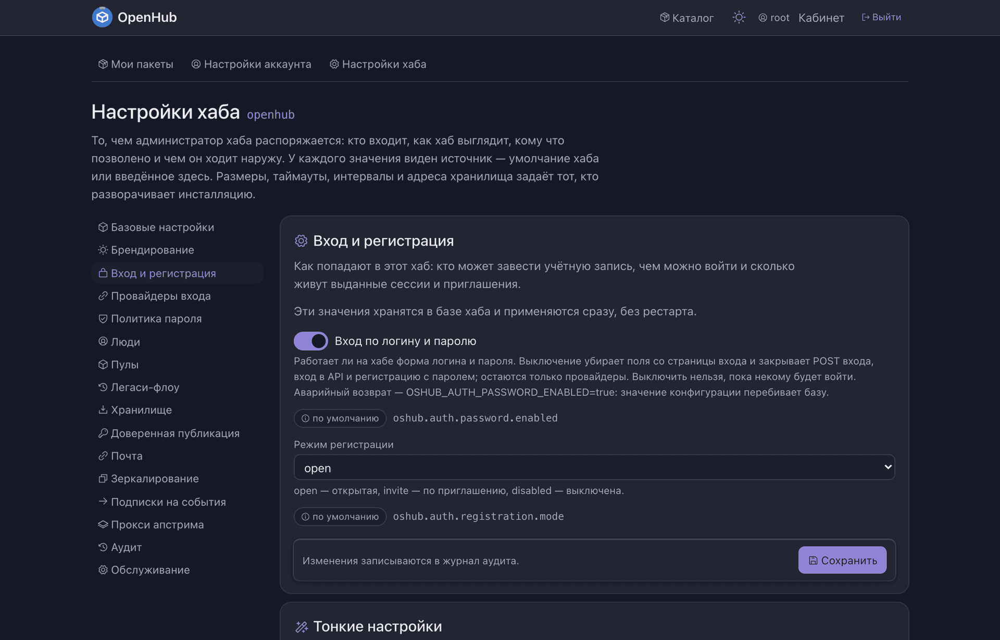

# Как настроить вход через провайдера

Чтобы в хаб входили учётной записью GitHub, GitLab, Google или вашего корпоративного
IdP — и чтобы ещё один пароль никому заводить не пришлось.

Провайдер заводится **из интерфейса и на живом хабе**: ни правки конфигов, ни
перезапуска. Заводить и править провайдеров вправе только администратор хаба.

---

## Что понадобится до начала

**Внешний адрес инсталляции.** Настройки хаба → Базовые настройки → «URL инстанса».
Из него хаб считает адрес возврата (`redirect_uri`), который вы пропишете у провайдера.
Пока адрес пуст, заведение провайдера отбивается — хаб не станет молча сохранять пустое
значение.

**Приложение на стороне провайдера.** У GitHub это OAuth App, у GitLab — Application,
у Google — OAuth-клиент, у корпоративного IdP — OIDC-клиент. Оттуда нужны `client_id`
и `client_secret`.

---

## 1. Завести провайдера

Настройки хаба → **Провайдеры входа**. Список показывает и заведённых здесь (помечены
«из базы»), и объявленных окружением; вторые помечены «задан конфигурацией» и правке
не поддаются — сервер отклоняет их сам, а не прячет кнопку.

Ниже — форма заведения. Первым делом выбирается **пресет**:

| Пресет | Что подставляет |
| --- | --- |
| GitHub | конечные точки, разбор профиля, подпись кнопки и значок |
| GitLab | то же + поле базового адреса, если GitLab self-hosted |
| Google | то же |
| Свой провайдер | ничего: адреса авторизации, токена и профиля вписываются руками |

Форма показывает **ровно те поля, которые нужны выбранному пресету**. Непустое поле,
которого пресет не показывает, отвергается с названной причиной — не «сохранилось
и не сработало», а отказ на форме.

Заполнить остаётся немного:

- **Имя** — короткий идентификатор, он попадёт в адрес `/login/oidc/{имя}`;
- **Метка** — подпись кнопки на странице входа: её видит человек;
- **client_id** и **client_secret** из приложения провайдера;
- **Адрес возврата** — хаб считает его сам и показывает готовым к копированию.
  Скопируйте и пропишите у провайдера как `redirect_uri`;
- **Области** — набор scope, который хаб запросит. Пресет подставляет базовый набор
  (`openid profile email`); нужен провижининг групп — область групп дописывается сюда же.

Имя, пресет, протокол и издатель у заведённого провайдера не правятся: такой провайдер
заводится заново. Всё остальное — метку, секрет, области, флажки — можно менять.

## 2. Проверить кнопку на странице входа

У каждого заведённого и включённого провайдера на `/login` появляется своя кнопка.

Отказ провайдера возвращает человека на страницу входа **с названной причиной**, а не
молча: по тексту видно, чинить настройку хаба или права у провайдера.

## 3. Решить, кого пускать

Свежая инсталляция незнакомых не пускает: личность, которой хаб не знает, получает отказ
`provisioning_disabled`, и учётная запись не появляется. Аутентификация у чужого IdP
сама по себе не заводит людей у вас — это умолчание, и оно намеренное.

Дальше две развилки, и они независимы:

**Автозаведение учёток** — флажок у провайдера. Включили: первый вход неизвестной
личности заводит новую учётку. Выключено: сначала учётка, потом привязка.

**Привязка к существующей учётке** делается **только владельцем и только из кабинета**:
Настройки аккаунта → Привязки OIDC. Вход неизвестной личностью, чей адрес совпал с
адресом существующей учётки, в эту учётку **не приводит** — иначе присвоить чужую
учётку можно было бы, заведя личность на её адрес.

Отвязка не отменяет учётную запись и не отбирает роли.

> Адрес из профиля провайдера попадает в пустую учётку, но **заполненный адрес
> не перетирается** — ни на входе, ни при повторной привязке. И подтверждённым такой
> адрес не становится: восстановить по нему доступ нельзя, пока человек не подтвердил
> его сам.

## 4. Закрыть провайдера для посетителей из страны

> **Правило пока никого не отсекает.** Оно сохраняется, правится, видно на экране и в журнале,
> но заработает только тогда, когда хаб научится определять страну посетителя.

Бывает, что способ входа нельзя предлагать всем: инсталляция обязана авторизовать
пользователей из своей страны только отечественными средствами. Для этого у каждого
провайдера есть правило **«закрыт в странах»**.

Правится оно на самом провайдере: Настройки хаба → **Провайдеры входа** → карточка
провайдера → **«Страны и доступ»**. Откроется окно с одним полем — коды стран
ISO 3166-1 alpha-2 через запятую, например `RU, BY`. Пустое поле снимает правило.

Что именно делает правило:

- посетителю из названной страны провайдер закрыт **целиком**: ему нельзя ни завести
  учётную запись, ни войти в существующую, ни привязать провайдера в кабинете;
- **страна не определилась — посетитель считается пришедшим из закрытой страны.**
  Не смог проверить — отказал; это осознанное умолчание, и оно названо прямо в подсказке
  поля;
- **под правило не попадают** публикация легаси-токеном GitHub, доверенная публикация
  из CI и вход из командной строки как таковой. Вход CLI через браузер видит ту же
  страницу входа — и на ней того же закрытого провайдера просто нет;
- правило действует сразу, без перезапуска, и правится **и у провайдера, заданного
  окружением**: переменные описывают, *как* хаб говорит с провайдером, а правило — *кому*
  он вправе его предлагать. Удаление провайдера уносит и его правило.

Сохраняя правило, вы видите в окне, **сколько учётных записей останется без другого
способа войти** (провайдер у них единственный) и что хаб может им предложить — включён ли
парольный вход и работает ли восстановление пароля. Нет ни того ни другого — окно говорит
об этом прямо: это предупреждение, а не запрет, сохранить можно.

Каждая правка правила пишется в журнал аудита вместе с тем, что вы при этом видели.

**Запереть страну целиком хаб не даст.** Нельзя выключить парольный вход, пока все
включённые провайдеры несут правило по стране, и нельзя повесить правило на последнего
свободного от правил провайдера при выключенном парольном входе. Оба отказа называют
причину словами.

## 5. Раздать права через группы IdP

Роли выдаются группам, а состав группы можно вести на стороне IdP — тогда нового
сотрудника не нужно заводить в хабе руками.

Настройки группы → **Связка с OIDC**: издатель, имя клейма (обычно `groups` или `roles`)
и его значение.

Как это работает:

- членство сверяется **на каждом входе** через провайдера — и добавление, и удаление:
  накинули группу в IAM — она появилась в хабе, забрали — исчезла;
- сверка идёт **из коробки**, как только заведена связка: отдельной настройки
  «синхронизировать права» нет и включать её не надо;
- сверка трогает только членство с источником `oidc`. Выданное в хабе руками членство
  она не снимает никогда;
- политикой выбирается, что делать с выпавшим из клейма: оставлять в группе или
  исключать;
- в составе группы виден источник каждого участника и время последней сверки.

Сами роли выдаются не здесь, а на объектах — в правах доступа пула и пакета: личные
и групповые права складываются.

## 6. Выключить парольный вход

Хаб, где все ходят через SSO, может закрыть пароли целиком: Настройки хаба →
**Вход и регистрация** → «Вход по логину и паролю».

Что произойдёт: со страницы входа исчезнут поля логина и пароля, вход по паролю в API
начнёт отвечать отказом (не отличая верный пароль от неверного), регистрация с паролем
закроется. Останутся только провайдеры.

Уже выданные сессии и токены продолжат работать, смена собственного пароля в кабинете
останется доступной.

**Запереть себя хаб не даст.** Выключение отбивается с названной причиной, если после
него не останется ни одного активного администратора с внешней личностью, ни одного
включённого провайдера того же издателя — либо если все включённые провайдеры закрыты
правилом по стране. Отбивается одинаково и из формы, и при прямом обращении к настройке.

Аварийный возврат, если IdP всё-таки лёг: переменная окружения
`OSHUB_AUTH_PASSWORD_ENABLED=true` — конфигурация перебивает базу.

---

## Чего пока нет

**Области набираются руками.** Задумано, чтобы хаб сам собирал набор scope из включённых
возможностей — поставил галку «провижининг групп», и область групп добавилась сама.
Сегодня это не так: поле «Области» редактируемое, и что в нём набрали, то хаб
у провайдера и попросит.

Заметнее всего это у провайдера, **объявленного окружением**: пресет выбран, а области
не подставляются, и провайдер отдаёт не то, ради чего пресет выбирали. Проявляется
молча — вход работает, а групп нет. Лечится тем же полем: вписать области руками
(переменной `SCOPES` у провайдера из окружения).
