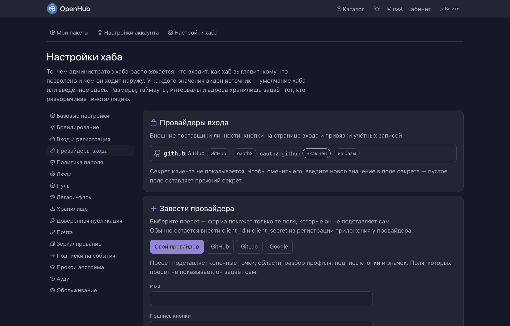
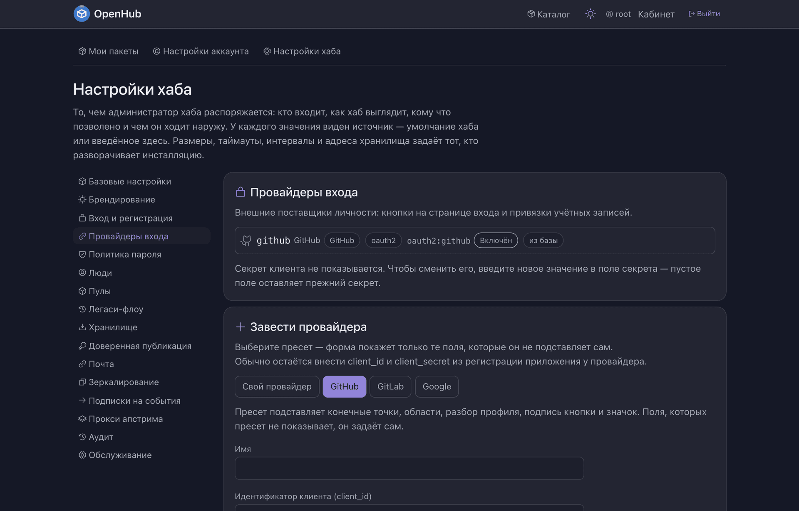
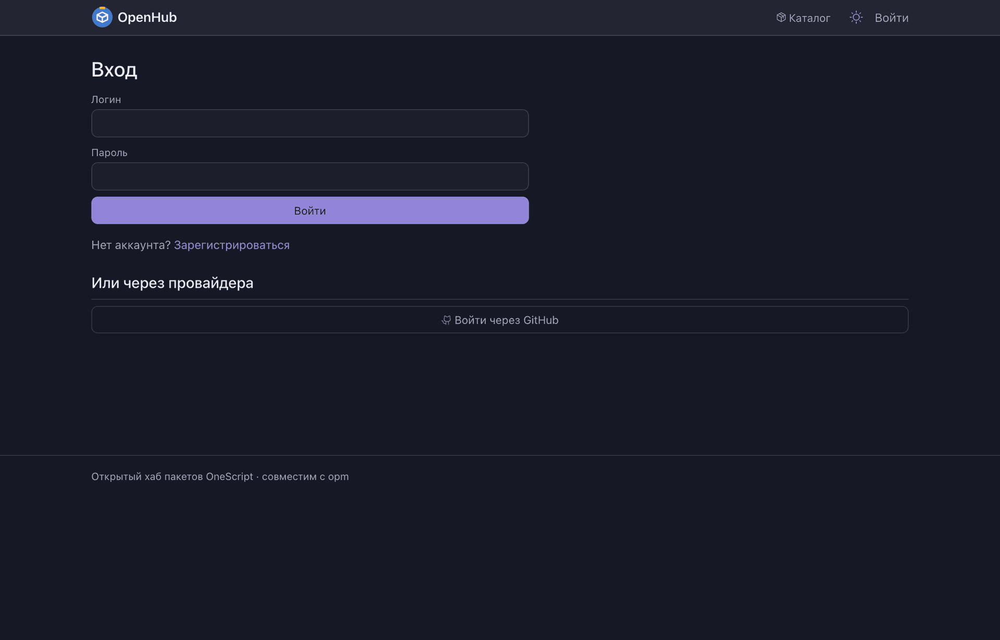
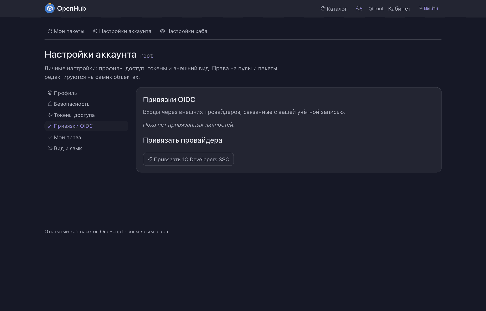
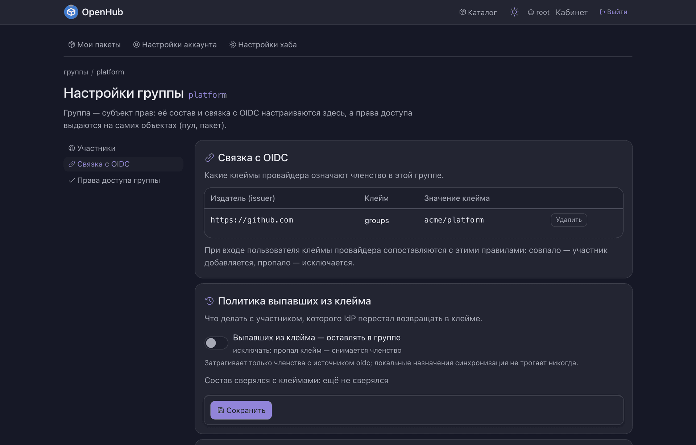
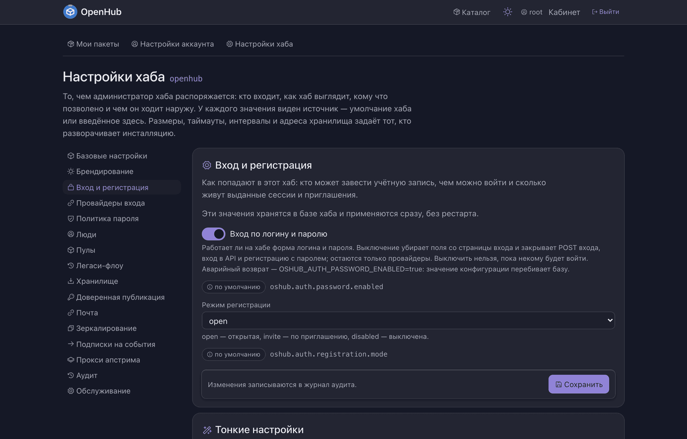

# Вход через провайдера

Чтобы в хаб входили учётной записью GitHub, GitLab, Google или вашего корпоративного
IdP — и чтобы ещё один пароль никому заводить не пришлось.

Провайдер заводится **из интерфейса и на живом хабе**: ни правки конфигов, ни
перезапуска. Заводить и править провайдеров вправе только администратор хаба.

---

## Что понадобится до начала

**Внешний адрес инсталляции.** Настройки хаба → Базовые настройки → «URL инстанса».
Из него хаб считает адрес возврата (`redirect_uri`), который вы пропишете у провайдера.
Пока адрес пуст, заведение провайдера отбивается — хаб не станет молча сохранять пустое
значение.

**Приложение на стороне провайдера.** У GitHub это OAuth App, у GitLab — Application,
у Google — OAuth-клиент, у корпоративного IdP — OIDC-клиент. Оттуда нужны `client_id`
и `client_secret`.

---

## 1. Завести провайдера

Настройки хаба → **Провайдеры входа**. Список показывает и заведённых здесь (помечены
«из базы»), и объявленных конфигурацией инсталляции; вторые помечены «задан конфигурацией»
и правке не поддаются — сервер отклоняет их сам, а не прячет кнопку.

Конфигурацией провайдер объявляется настройкой-узлом `oshub.oidc`: список `providers`
и ветка полей на каждого — `label`, `icon`, `issuer`, `client_id`, `client_secret`,
`redirect_uri`, `scopes`, `groups_claim`, `autoprovision`, `provision_groups`,
`link_groups_by_name`, `group_prefix`. Переменными окружения — по общему правилу имён
([настройки](настройки.md#имя-переменной)), подчёркивание внутри поля удваивается; дефис
в идентификаторе провайдера из оболочки не набрать, только из Docker и Kubernetes:

```bash
OSHUB_OIDC_PROVIDERS=keycloak
OSHUB_OIDC_KEYCLOAK_ISSUER=https://sso.example.org/realms/main
OSHUB_OIDC_KEYCLOAK_CLIENT__ID=openhub
OSHUB_OIDC_KEYCLOAK_CLIENT__SECRET=…
OSHUB_OIDC_KEYCLOAK_REDIRECT__URI=https://hub.example.org/oidc/callback
```



Ниже — форма заведения. Первым делом выбирается **пресет**:

| Пресет | Что подставляет |
| --- | --- |
| GitHub | конечные точки, разбор профиля, подпись кнопки и значок |
| GitLab | то же + поле базового адреса, если GitLab self-hosted |
| Google | то же |
| Свой провайдер | ничего: адреса авторизации, токена и профиля вписываются руками |

Форма показывает **ровно те поля, которые нужны выбранному пресету**. Непустое поле,
которого пресет не показывает, отвергается с названной причиной — не «сохранилось
и не сработало», а отказ на форме.



Заполнить остаётся немного:

- **Имя** — короткий идентификатор, он попадёт в адрес `/login/oidc/{имя}`;
- **Метка** — подпись кнопки на странице входа: её видит человек;
- **client_id** и **client_secret** из приложения провайдера;
- **Адрес возврата** — хаб считает его сам и показывает готовым к копированию.
  Скопируйте и пропишите у провайдера как `redirect_uri`;
- **Области** — набор scope, который хаб запросит у провайдера, ровно как записан. Пресет
  подставляет базовый набор; для провижининга групп область групп дописывают сюда же,
  иначе клейма групп в ответе провайдера нет. Провайдер из конфигурации без `scopes`
  просит `openid profile email groups`.

Имя, пресет, протокол и издатель у заведённого провайдера не правятся: такой провайдер
заводится заново. Всё остальное — метку, секрет, области, флажки — можно менять.

## 2. Проверить кнопку на странице входа

У каждого заведённого и включённого провайдера на `/login` появляется своя кнопка.



Отказ провайдера возвращает человека на страницу входа **с названной причиной**, а не
молча: по тексту видно, чинить настройку хаба или права у провайдера.

## 3. Решить, кого пускать

Свежая инсталляция незнакомых не пускает: личность, которой хаб не знает, получает отказ
`provisioning_disabled`, и учётная запись не появляется. Аутентификация у чужого IdP
сама по себе учёток не заводит.

Дальше две развилки, и они независимы:

**Автозаведение учёток** — флажок у провайдера. Включили: первый вход неизвестной
личности заводит новую учётку. Выключено: сначала учётка, потом привязка.

**Привязка к существующей учётке** делается **только владельцем и только из кабинета**:
Настройки аккаунта → Привязки OIDC. Вход неизвестной личностью, чей адрес совпал с
адресом существующей учётки, в эту учётку **не приводит** — иначе присвоить чужую
учётку можно было бы, заведя личность на её адрес.



Отвязка не отменяет учётную запись и не отбирает роли.

> Поручился провайдер за адрес — прислал `email_verified`, — и адрес считается
> **подтверждённым**: такой учётке открыт и вход паролем, и «Забыли пароль?». Не
> поручился — адрес остаётся неподтверждённым, и подтвердить его может только сам
> человек, перейдя по ссылке из письма хаба.
>
> Адрес из профиля провайдера попадает в пустую учётку, но **заполненный адрес
> не перетирается** — ни на входе, ни при повторной привязке.

## 4. Закрыть провайдера для посетителей из страны

Бывает, что способ входа нельзя предлагать всем: инсталляция обязана авторизовать
пользователей из своей страны только отечественными средствами. Для этого у каждого
провайдера есть правило **«закрыт в странах»**.

Правится оно на самом провайдере: Настройки хаба → **Провайдеры входа** → карточка
провайдера → **«Страны и доступ»**. Откроется окно с одним полем — коды стран
ISO 3166-1 alpha-2 через запятую, например `RU, BY`. Пустое поле снимает правило. Сверх
списка ISO хаб знает `XK` — так Косово называют геобазы, и в них же он его увидит.

Что именно делает правило:

- посетителю из названной страны провайдер закрыт **целиком**: ему нельзя ни завести
  учётную запись, ни войти в существующую, ни привязать провайдера в кабинете;
- **страна не определилась — посетитель считается пришедшим из закрытой страны.**
  Об этом говорит подсказка поля;
- **под правило не попадают** публикация легаси-токеном GitHub, доверенная публикация
  из CI и вход из командной строки как таковой. Вход CLI через браузер видит ту же
  страницу входа — и на ней того же закрытого провайдера просто нет;
- правило действует сразу, без перезапуска, и правится **и у провайдера, заданного
  конфигурацией**: конфигурация описывает, *как* хаб говорит с провайдером, а правило — *кому*
  он вправе его предлагать. Удаление провайдера уносит и его правило.

Сохраняя правило, вы видите в окне, **сколько учётных записей останется без другого
способа войти** (провайдер у них единственный) и что хаб может им предложить — включён ли
парольный вход и работает ли восстановление пароля. Нет ни того ни другого — окно говорит
об этом прямо: это предупреждение, а не запрет, сохранить можно.

Каждая правка правила пишется в журнал аудита вместе с тем, что вы при этом видели.

**Запереть страну целиком хаб не даст.** Нельзя выключить парольный вход, пока все
включённые провайдеры несут правило по стране, и нельзя повесить правило на последнего
свободного от правил провайдера при выключенном парольном входе. Оба отказа называют
причину словами.

### Что видит закрытый посетитель

Кнопки закрытого провайдера на странице входа и в кабинете просто нет: кнопка и отказ
спрашивают одно и то же правило. Если он всё-таки откроет адрес входа, привязки или
возврата от провайдера, хаб ответит **403** и скажет человеческими словами: *этот способ
входа недоступен из вашего региона*. Кода страны в отказе нет — человеку важно не то,
каким его увидел хаб, а чем войти вместо. Поэтому ниже отказа названо только то, что
на этой инсталляции действительно открыто: форма входа по логину и паролю, ссылка
«Забыли пароль?» — когда восстановление работает, — и оставшиеся провайдеры. Нет ничего
из этого — хаб отправляет к администратору.

Каждый такой отказ виден в журнале приложения (адрес посетителя там обезличен: сеть
остаётся, хозяин адреса — нет) и считается счётчиком телеметрии `oshub.login.geo_denied`.
В журнал аудита отказы не идут: аудит — журнал изменений, а не лог доступа.

### Страна посетителя

Страну хаб определяет встроенной базой DB-IP Lite Country, вторым источником — заголовком
страны от доверенного обратного прокси. Пока на хабе нет ни одного правила, страна
не спрашивается вовсе. Файл базы, ключи, порядок источников и атрибуция —
[эксплуатация](эксплуатация.md#страна-посетителя).

⚠ **Пока база не может назвать страну, правило закрывает провайдера всем.** Файл базы
не положен, индекс не построен, хаб за обратным прокси без `OSHUB_INSTANCE_TRUSTED__PROXIES` —
страна посетителя неизвестна и считается закрытой. Окно «Страны и доступ» первой строкой
показывает состояние базы и печатает «Страна вашего запроса» тем же определителем, каким
судит посетителей; то же предупреждение стоит на карточке провайдера с правилом.

## 5. Раздать права через группы IdP

Роли выдаются группам, а состав группы можно вести на стороне IdP — тогда нового
сотрудника не нужно заводить в хабе руками.

Настройки группы → **Связка с OIDC**: издатель, имя клейма (обычно `groups` или `roles`)
и его значение.



Как это работает:

- членство сверяется **на каждом входе** через провайдера — и добавление, и удаление:
  накинули группу в IAM — она появилась в хабе, забрали — исчезла;
- сверка идёт **из коробки**, как только заведена связка: отдельной настройки
  «синхронизировать права» нет и включать её не надо;
- сверка трогает только членство с источником `oidc`. Выданное в хабе руками членство
  она не снимает никогда;
- политикой выбирается, что делать с выпавшим из клейма: оставлять в группе или
  исключать;
- в составе группы виден источник каждого участника и время последней сверки.

Сами роли выдаются не здесь, а на объектах — в правах доступа пула и пакета: личные
и групповые права складываются.

## 6. Выключить парольный вход

Хаб, где все ходят через SSO, может закрыть пароли целиком: Настройки хаба →
**Вход и регистрация** → «Вход по логину и паролю».



Что произойдёт: со страницы входа исчезнут поля логина и пароля, вход по паролю в API
начнёт отвечать отказом (не отличая верный пароль от неверного), регистрация с паролем
закроется. Останутся только провайдеры.

Уже выданные сессии и токены продолжат работать, смена собственного пароля в кабинете
останется доступной.

**Запереть себя хаб не даст.** Выключение отбивается с названной причиной, если после
него не останется ни одного активного администратора с внешней личностью, ни одного
включённого провайдера того же издателя — либо если все включённые провайдеры закрыты
правилом по стране. Отбивается одинаково и из формы, и при прямом обращении к настройке.

Аварийный возврат, если IdP всё-таки лёг: переменная окружения
`OSHUB_AUTH_PASSWORD_ENABLED=true` — конфигурация перебивает базу.
