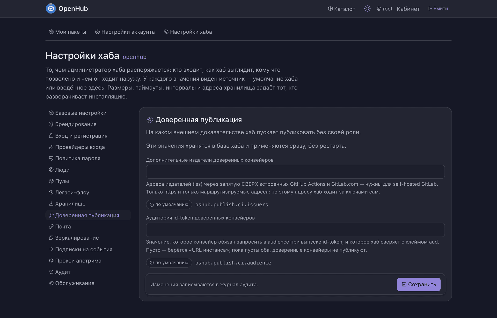
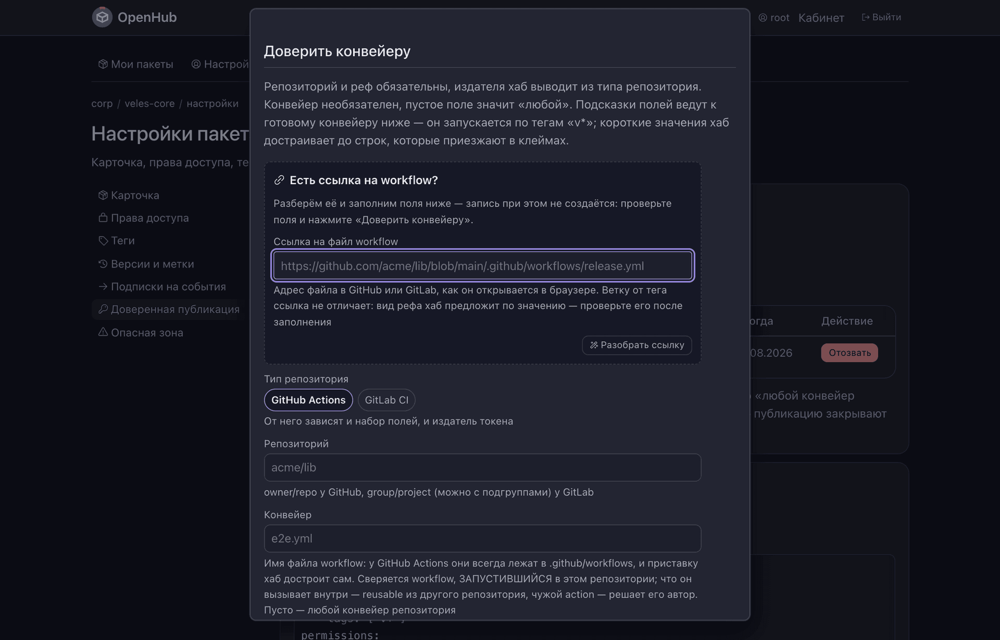

# Как настроить доверенную публикацию

Чтобы конвейер сборки публиковал ваш пакет **без токена хаба в секретах репозитория**.

То же, что в других экосистемах зовут *trusted publishing*. Конвейер не хранит ничего:
он просит у своего провайдера (GitHub Actions, GitLab CI) короткоживущий `id-token`,
предъявляет его хабу, а хаб проверяет подпись токена и сверяет, из какого репозитория
и с какого рефа тот выпущен.

Первоисточники механизма, если хочется читать в оригинале:
[PyPI — Trusted Publishers](https://docs.pypi.org/trusted-publishers/) и
[GitHub Actions — OpenID Connect](https://docs.github.com/en/actions/deployment/security-hardening-your-deployments/about-security-hardening-with-openid-connect).

---

## Зачем

Обычный путь публикации из CI — положить токен хаба в секреты репозитория. Токен живёт
долго, лежит там же, где код, и виден каждому, кто получил доступ к настройкам
репозитория. Утечёт — публиковать вашим именем сможет кто угодно, и вы об этом
не узнаете.

Доверенная публикация убирает сам предмет утечки: секрета нет. Есть запись «этому
репозиторию и этому рефу разрешено публиковать этот пакет» — на стороне хаба, где вы её
видите и в любой момент отзываете.

---

## 1. Задать аудиторию (один раз на хаб)

Настройки хаба → **Доверенная публикация**.



| Настройка | Что это |
| --- | --- |
| **Аудитория id-token** | значение, которое конвейер обязан запросить в `audience`, а хаб сверит с клеймом `aud`. Пусто — берётся «URL инстанса» |
| **Дополнительные издатели** | адреса `iss` через запятую **сверх** встроенных GitHub Actions и GitLab.com — нужны для self-hosted GitLab |

**Пока пусты и аудитория, и URL инстанса, доверенные конвейеры не публикуют вовсе** —
и готовый конвейер на странице пакета нечем заполнить. Проще всего задать URL инстанса
в базовых настройках: аудитория подтянется из него.

Издатели принимаются только по `https` и только маршрутизируемые: по этому адресу хаб
ходит за ключами сам.

## 2. Доверить конвейеру (на каждом пакете)

Настройки пакета → **Доверенная публикация** → «Доверить конвейеру».


Форма умеет разобрать ссылку: вставьте адрес файла workflow, как он открывается
в браузере, нажмите «Разобрать ссылку» — поля заполнятся сами. Запись при этом
не создаётся: проверьте, что получилось, и только потом жмите «Доверить конвейеру».



| Поле | Что вписывать |
| --- | --- |
| **Тип репозитория** | GitHub Actions или GitLab CI — от него зависят и набор полей, и издатель токена |
| **Репозиторий** | `owner/repo` у GitHub, `group/project` (можно с подгруппами) у GitLab |
| **Конвейер** | имя файла workflow (`release.yaml`); приставку `.github/workflows` хаб достроит сам. Пусто — любой конвейер репозитория |
| **Ветка, тег или маска** | `v*` для тегов релизов, `main`, `release/*`; `*` — любые символы кроме `/`, `**` — включая `/` |
| **Вид рефа** | чем считать короткое имя или маску: веткой или тегом |
| **Издатель** (под катом) | заполняется только на инсталляции с несколькими издателями одного типа — например с self-hosted GitLab |

**Совпасть должно каждое поле записи.** Пустым остаётся только конвейер — это «любой
конвейер репозитория».

> ⚠ **Маска, не ограничивающая имя, отдаёт пакет любой ветке.** `**`, `*`,
> `refs/heads/*` означают публикацию с ЛЮБОЙ ветки доверенного репозитория, а это
> классическая атака на GitHub Actions: ветка с изменённым workflow получает `id-token`
> того же репозитория — и вместе с ним право публиковать ваш пакет. Хаб такую маску
> принимает, но пишет об этом прямо на форме. Называйте ветку релизов или маску `v*`.

Сверяется workflow, **запустившийся в этом репозитории**. Что он вызывает внутри —
reusable-workflow из другого репозитория, чужой action — решает его автор, и хаб этого
не видит.

### Чего доверие не делает

- **не заводит новых имён.** Первую версию под новым именем публикует человек: доверие
  раздаётся на существующий пакет;
- **не даёт роли.** Это отдельная дверь в один конкретный пакет, а не участие в пуле;
- настроить доверие вправе мейнтейнер пакета и выше — одинаково на экране и в API.
  Токен только на чтение доверие не настраивает.

Заведение и отзыв доверия попадают в журнал аудита.

## 3. Забрать готовый конвейер

Рядом со списком хаб печатает **готовый конвейер с реальным адресом вашей инсталляции** —
скопировать в репозиторий и поправить шаги сборки под свой проект. Вот как выглядит
вариант для GitHub Actions:

```yaml
name: publish
on:
  push:
    tags: ['v*']
permissions:
  contents: read
  id-token: write          # без этого GitHub не выпустит id-token
jobs:
  publish:
    runs-on: ubuntu-latest
    env:
      audience: https://hub.example.ru
      hub: https://hub.example.ru
      pool: corp
      package: veles-core
    steps:
      - uses: actions/checkout@v4
      - uses: otymko/setup-onescript@v1.5.1
        with:
          version: stable
      - run: opm install opm@1.6.5
      - run: opm install -l && opm build .
      - name: push
        run: |
          id_token=$(curl -sSf -H "Authorization: bearer $ACTIONS_ID_TOKEN_REQUEST_TOKEN" \
            "$ACTIONS_ID_TOKEN_REQUEST_URL&audience=$audience" | jq -r .value)
          version="${GITHUB_REF_NAME#v}"
          file="${package}-${version}.ospx"
          test -f "$file" || { echo "tag $GITHUB_REF_NAME does not match the package version in packagedef"; exit 1; }
          curl -sSf -X POST "$hub/api/v1/pools/$pool/push" \
            -H "OAUTH-TOKEN: $id_token" \
            -H "FILE-NAME: $(basename $file)" \
            --data-binary "@$file"
```

Для GitLab CI хаб печатает такой же блок с `id_tokens:` и `aud:` — берите его
со страницы, там уже подставлены ваш адрес, пул и имя пакета.

Обратите внимание: `id-token` предъявляется **тем же заголовком**, что и обычный токен
доступа. Модифицированный клиент не нужен, и второй реализации публикации в хабе нет —
правила приёма, отказы и след в журнале общие с обычным `opm push`.

## 4. Убедиться, что сработало

Опубликованная доверенным конвейером версия получает **значок** — на карточке пакета
и в списке версий, всюду, где человек видит версию.

Значок называет механизм, а не оценку: «опубликовано доверенным конвейером», а не
«безопасно». Версия без значка ничем не помечена как плохая: доверенная публикация —
опция, и обычные публикации хаб принимает как принимал.

Признак берётся из того, **как версия была принята**, а не из слов публикующего:
заголовок запроса, поле манифеста или галочка в форме значка не дают. Поэтому ручная
замена номера (push с `?force=1`) значок снимает — иначе он врал бы про артефакт,
который лежит сейчас.

---

## Если публикация отвергнута

| Симптом | Куда смотреть |
| --- | --- |
| конвейер не получил токен вовсе | в workflow нет `permissions: id-token: write` (GitHub) или блока `id_tokens` (GitLab) |
| хаб отвечает отказом на аудиторию | `audience` в конвейере не совпал с настройкой хаба; пусты и аудитория, и URL инстанса |
| отказ по репозиторию или рефу | публикация идёт с ветки или тега, не попавшего под маску; сверяется каждое поле записи |
| издатель неизвестен | self-hosted GitLab не добавлен в «Дополнительные издатели» |
| пакета нет | доверие не создаёт имён — опубликуйте первую версию руками |

---

## Не путать с легаси-флоу GitHub

В настройках хаба есть раздел «Легаси-флоу» — временный механизм переезда авторов
зеркала `oscript-library`: публикация **токеном GitHub** для того, у кого есть право
записи в одноимённый репозиторий организации. Это другое: там долгоживущий токен
и внешний источник права, работает он только в основном пуле и по умолчанию выключен.
Доверенная публикация к нему отношения не имеет.
