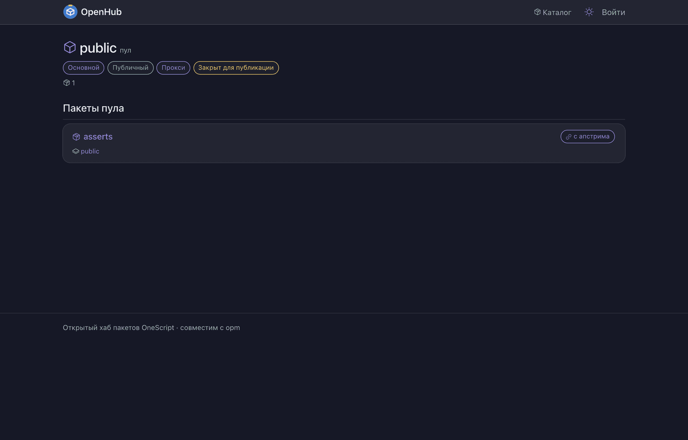
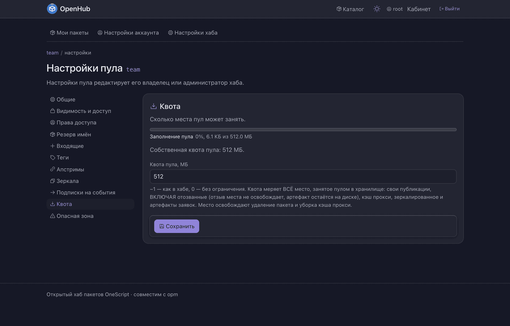
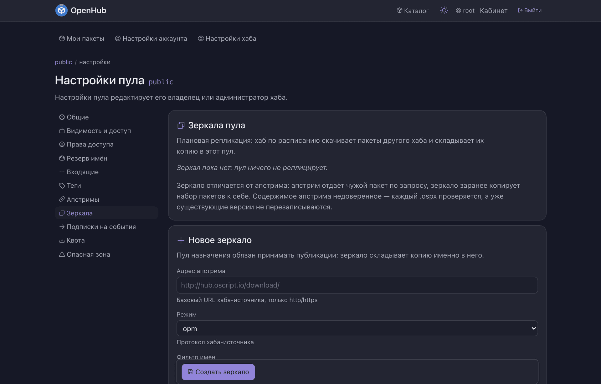
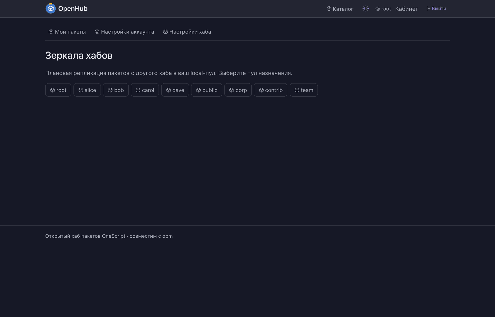

# Как настроить кэширующий прокси

Чтобы разработчики и сборки ставили пакеты **через ваш хаб** — и свои, и публичные, —
одним адресом. Чего у вас нет, хаб сходит и возьмёт у чужого хаба, а потом оставит
у себя.

---

## Зачем

Без прокси у каждой машины в `opm.cfg` живёт список серверов, и человек должен помнить,
что где лежит. А ещё сборка падает ровно тогда, когда лёг чужой хаб — хотя вчера тот же
пакет уже скачивали.

Пул с источником решает обе задачи: один адрес в конфигурации, и цена похода наружу
платится **один раз** на версию.

---

## Апстрим и зеркало — это разные вещи

Их легко перепутать, а настраиваются они в соседних разделах.

| | **Апстрим** (источник) | **Зеркало** |
| --- | --- | --- |
| Когда ходит наружу | по запросу, которого не закрыл свой реестр | по расписанию, заранее |
| Что приносит | ровно то, что спросили | набор пакетов пачкой |
| Зачем | «ставить всё через нас» | «пусть лежит у нас до того, как спросят» |
| Где настраивается | Настройки пула → **Апстримы** | Настройки пула → **Зеркала** |

Одно другому не мешает: пул может и реплицировать набор по ночам, и добирать
недостающее по запросу.

Общее у них одно: **содержимое чужого хаба недоверенное**. Каждый `.ospx` проверяется,
а уже существующие версии не перезаписываются.

---

## 1. Подключить источник к пулу

Настройки пула → **Апстримы**.

Источник — это **базовый адрес выдачи** чужого хаба: тот самый, который вписывают
в `opm.cfg` как `ПутьНаСервере`. Принимаются `http` и `https`; хаб на подпути
(`…/pools/{пул}/download/`) — тоже источник, а не только корень чужого сайта.

Перед сохранением хаб **пробует подключиться**. Не подключился — источник не заводится,
и причина написана здесь же, на форме.

У источника есть **TTL** (по умолчанию 900 с) — срок, в течение которого хаб верит
своему прошлому ответу о том, что у источника есть и какая версия там последняя.

Дальше список ведётся как список:

- **порядок значим** — опрос идёт сверху вниз, кнопками «Выше» и «Ниже» он меняется;
- источник **выключается, не удаляясь**: остаётся в списке со своим адресом и порядком,
  но не опрашивается;
- источников может быть сколько угодно: ни одного, один, несколько.

Источником бывает только **чужой** хаб: пул этой же инсталляции источником не назначается.
Личные пространства источников не имеют вовсе.

Приватный пул на стороне источника читается по токену — он задаётся вместе с адресом.

В том же разделе живёт тумблер **«Публикация разрешена»**. Выключите его — и получится
чистый прокси-кэш: пул только раздаёт то, что взял с источников, а `opm push` в него
не принимается. Включите — тот же пул принимает и свои публикации, и они с привезённым
уживаются: свои пакеты всегда проверяются **раньше** источников, поэтому одноимённый
пакет снаружи ваш не подменит.

## 2. Понять, что теперь происходит

Запрос, который не закрывается собственным реестром пула, обслуживается источниками —
по порядку. Найденное **остаётся в пуле**: попадает и в хранилище, и в реестр, так что
пакет находится поиском и виден в списке.

Что хранится и сколько:

- **файл конкретной версии — навсегда.** Он неизменяем, второй раз за ним не ходят;
- **список имён и «последняя версия» — на срок TTL источника.** Они меняются, и вчерашний
  ответ на них уже неправда. Если у источника ничего не изменилось, тело заново
  не качается.

Отдельно стоит запомнить три обещания:

- **лежащий источник не превращает запрос в ошибку** — отдаётся то, что уже привезли;
- **сбой на пути к источнику не выдаётся за «пакета нет»**: по ответу видно, что виноват
  не клиент. «Нет такого пула», «нет такого пакета» и «нет такой версии» тоже различимы;
- **своё имя чужим хабом не подменяется.** На одной координате (имя + версия) всегда
  отдаётся ваша версия; одноимённая версия источника её не перекроет. Совпадение имени
  попадает в журнал и в аудит — обычно это не атака, а случайно занятое имя.

## 3. Настроить поведение прокси

Настройки хаба → **Прокси апстрима**. Значения общие для всей инсталляции, живут в базе
и применяются сразу, без рестарта.

| Настройка | Что делает |
| --- | --- |
| **Офлайн** | хаб обслуживает запросы только из своего кэша и наружу не ходит вовсе. Чего в кэше нет — того при включённом офлайне не найдётся |
| **Таймаут похода в апстрим** | сколько ждать ответа чужого хаба, прежде чем счесть его недоступным |
| **Срок отрицательного ответа** | сколько помнить, что у источника такого пакета нет, не переспрашивая |
| **Перепроверка живости источника** | как часто заново выяснять, отвечает ли источник |
| **Потолок перенаправлений** | сколько переходов по `Location` делать, прежде чем счесть цепочку бесконечной |

## 4. Ограничить место

Пул, стоящий перед чужим хабом, растёт сам по себе, поэтому ему ставят квоту:
Настройки пула → **Квота**.

Когда пул упирается в предел, место освобождается **вытеснением привезённого**, начиная
с самого давнего. Правила здесь простые и намеренно жёсткие:

- **своя публикация не вытесняется никогда** — в том числе отозванная и самая давняя;
- то, чего уборка не смогла опознать, она не трогает: сомнение решается в пользу
  сохранности;
- вытесненное не пропадает для пользователя: следующее обращение привезёт его снова,
  заметна будет только задержка;
- пул без предела уборкой не обрабатывается, пул без источников — тоже.

Квота меряет **всё** место, занятое пулом: свои публикации (включая отозванные — отзыв
места не освобождает), кэш прокси, зеркалированное и артефакты заявок.

## 5. Реплицировать набор заранее (зеркало)

Если ждать первого запроса не хочется, заведите зеркало: Настройки пула → **Зеркала**.

| Поле | Что вписывать |
| --- | --- |
| **Адрес апстрима** | базовый URL хаба-источника, `http`/`https` |
| **Режим** | протокол хаба-источника (`opm`) |
| **Фильтр имён** | JSON-массив масок имён пакетов; пусто — забирать всё |
| **Интервал синхронизации** | секунды; пусто — интервал по умолчанию, слишком малые значения поднимаются до минимального |

Пул назначения обязан **принимать публикации** — зеркало складывает копию именно в него.
При этом пул можно оставить закрытым для публикации людьми: зеркало наполнит его всё
равно.

Как это работает дальше:

- прогон идёт по расписанию, а кнопка «синхронизировать» отвечает сразу — работа уходит
  в фон, экран показывает состояние: что зеркало делает и когда синхронизировалось;
- обход **продолжается с курсора**: повторный прогон докачивает недостающее, а не
  начинает сначала;
- на одно зеркало — один прогон; брошенный прогон отпускает зеркало сам, по молчанию;
- зеркало **выключается, не удаляясь**.

Числа репликации — сколько зеркал разрешено пулу, как часто они ходят, через сколько
молчания прогон считается брошенным — в настройках хаба, раздел **Зеркалирование**.
Там же общий рубильник фоновой синхронизации: выключенная не принимает заявок ни от
расписания, ни от кнопки.

Когда зеркал становится много, их удобнее смотреть одним списком — «Зеркала всех пулов»:
состояние прогона и дата последней синхронизации по всем пулам, которыми вы
распоряжаетесь.

---

## Чего ожидать не стоит

**Карточка привезённого пакета пустая.** У пакета, приехавшего с источника, нет ни
описания, ни ключевых слов, а вкладка зависимостей пишет «ни от чего не зависит».
Манифест апстрима в карточку вашего пула не переносится — карточку заполняет только
публикация в этот хаб.

**`opm update` не видит обновлений у имени, где есть ваша версия.** Сегодня защита
от подмены имени работает строже, чем задумано: у имени, под которым здесь хоть что-то
публиковали, источники не опрашиваются вовсе, и «последней» считается максимум среди
своих. Обходится точной координатой: конкретная версия источника скачивается по-прежнему.

**Общего тумблера «не ходить наружу» у выдачи нет** — кроме офлайна прокси, который
выключает походы у всей инсталляции сразу. Не хотите ходить в конкретный источник —
выключите сам источник: это его свойство, а не режим выдачи.
