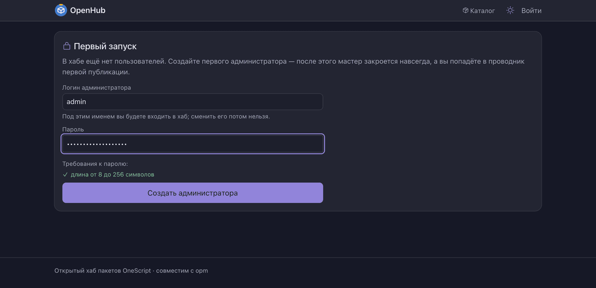
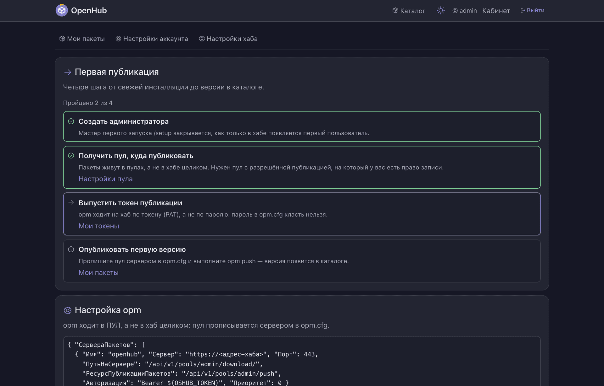
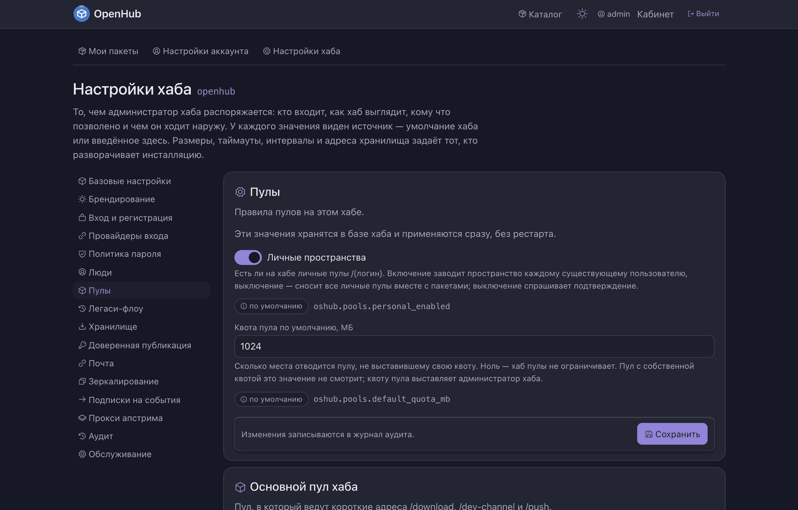
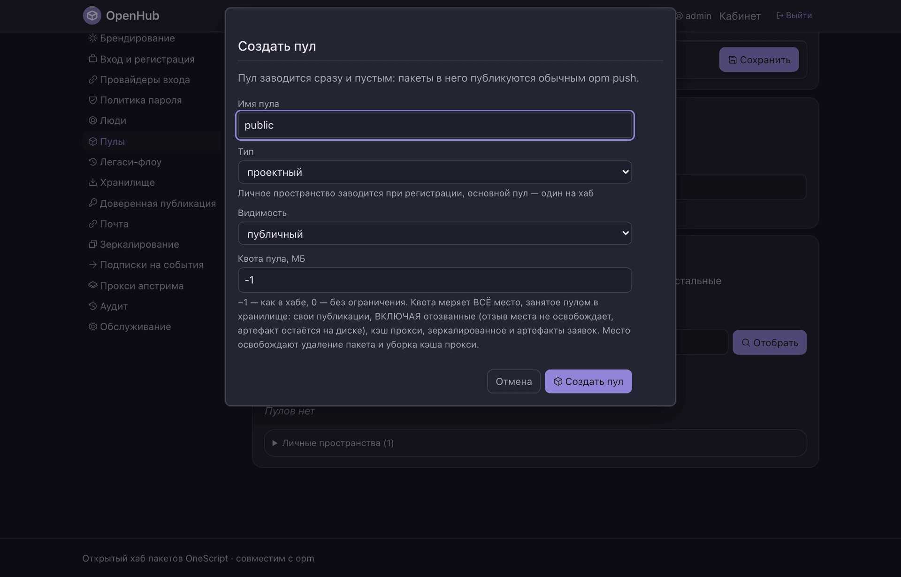
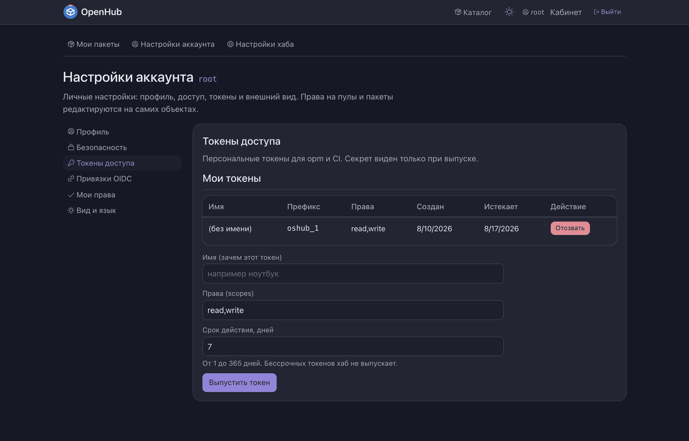

# Как развернуть свой хаб

От пустой машины до первой опубликованной версии. Займёт минут пятнадцать.

Нужен **OneScript 2.0+**. Внешних служб — базы, S3, почтового сервера — на этом пути
не понадобится: хаб поднимется на файловой базе рядом с собой.

---

## 1. Поставить хаб

```bash
opm install openhub
```

`opm` притащит хаб и все его зависимости и положит в `PATH` команду `openhub`.

Команда берёт настройки и складывает данные **в текущем каталоге**, поэтому хаб живёт
там, откуда его запустили. Заведите ему каталог:

```bash
mkdir ~/openhub && cd ~/openhub
```

> Второй способ — контейнером: `docker run -d -p 3333:3333 -v openhub-data:/var/lib/openhub segateekb/openhub`.
> Тогда шаг с файлом настроек можно пропустить: образ уже настроен на SQLite и файловое
> хранилище на томе. Подробности — [docker/README.md](../docker/README.md).

## 2. Написать файл настроек

Положите рядом `autumn-properties.json`. Вот минимальный рабочий файл: SQLite и файловое
хранилище, и то и другое — в подкаталоге `./data`.

```json
{
    "winow": { "Порт": 3333 },
    "data": {
        "ИсточникиДанных": {
            "ТипКоннектора": "КоннекторSQLite",
            "СтрокаСоединения": "Data Source=./data/openhub.db"
        }
    },
    "oshub": {
        "storage": { "root": "./data" },
        "pools": { "default": "public" }
    }
}
```

Что здесь что:

| Ключ | Назначение |
| --- | --- |
| `winow.Порт` | порт HTTP-сервера |
| `data.ИсточникиДанных` | база: коннектор и строка соединения |
| `oshub.storage.root` | каталог данных: файлы пакетов и `аудит.log` |
| `oshub.pools.default` | имя основного пула — того, что отвечает на короткие адреса |

Схему хаб создаст сам при первом старте: миграций в проекте нет, накатывать нечего.

**В файл кладут только то, что нужно до подключения к базе** — порт, базу, хранилище.
Всё остальное (режим регистрации, провайдеры входа, квоты, сроки токенов, поведение
прокси) настраивается **в веб-интерфейсе** и хранится в базе. Значение, заданное файлом,
в интерфейсе показывается как «задано конфигурацией» и не редактируется — так видно,
почему поле не поддаётся.

**Секреты в этот файл не пишут.** Пароли, ключи S3 и клиентские секреты OIDC передаются
переменными окружения или файлами-секретами.

### Другая база

Хаб работает через ORM и к конкретной СУБД не привязан:

| Коннектор | Строка соединения | Когда |
| --- | --- | --- |
| `КоннекторSQLite` | `Data Source=./data/openhub.db` | личный, командный и небольшой корпоративный хаб |
| `КоннекторPostgreSQL` | `Host=db;Username=openhub;Password=…;Database=openhub;` | нагруженная инсталляция, несколько процессов хаба |
| `КоннекторJSON` | `./data/entities` | каталог JSON-файлов, вообще без СУБД: разработка, пробы, демо |

MySQL в этом ряду нет: коннектора к ней в `entity` не существует — драйвер в пакете `sql`
лежит, а коннектора поверх него никто не написал.

### Переменные окружения

Любое значение перебивается переменной `OSHUB_*`; порядок — **окружение → файл →
умолчания**. Имя выводится из имени детальки заменой `_` → `.` (а `__` → `_`):
`OSHUB_STORAGE_ROOT` → `oshub.storage.root`. Отдельно стоят `OSHUB_PORT`,
`OSHUB_DB_CONNECTOR`, `OSHUB_DB_CONNECTION` и `OSHUB_DEFAULT_POOL`.

## 3. Запустить

```bash
openhub
```

Хаб пишет в журнал ход старта и открывает порт **последним** — до строки
`Стартовые задачи завершены — открываю порт` соединение отклоняется. Готовность
спрашивают у `/ready`, живость — у `/health`.

## 4. Завести первого администратора

Пользователей в базе нет, и хаб включает режим онбординга: любая публичная страница
уводит на **`/setup`**.


Придумайте логин и пароль. Логин потом не сменить — он и есть имя вашего личного
пространства.



Как только администратор появился, мастер закрывается **навсегда**: второй раз `/setup`
не откроется никому.

### Развёртывание без рук

Если хаб разворачивает не человек, а плейбук, мастер можно пропустить:

```bash
OSHUB_ADMIN_LOGIN=admin OSHUB_ADMIN_PASSWORD_FILE=/run/secrets/openhub_admin openhub
```

Администратор создаётся при старте с требованием сменить пароль при первом входе.
`OSHUB_ADMIN_PASSWORD` со значением тоже работает, но файл-секрет безопаснее: значение
переменной видно в списке процессов.

## 5. Пройти проводник первой публикации

Сразу после мастера хаб приводит вас на `/tour` — четыре шага от свежей инсталляции
до версии в каталоге. Проводник не рассказывает, а **проверяет**: отмечает шаг, когда тот
действительно сделан.



Первый шаг уже зелёный — администратор есть. Второй тоже: вместе с учёткой завелось
ваше личное пространство, и публиковать можно прямо в него. Но для команды нужен
общий пул.

## 6. Завести первый пул

Пакеты публикуются не «в хаб», а в конкретный пул, поэтому на свежем хабе пулов нет.



Зайдите в **Настройки хаба → Пулы** и нажмите «Создать пул».



Имя пула займёт первый сегмент адреса: пакет `veles-core` в пуле `public` будет жить
по `/public/veles-core`. Пул с именем из `oshub.pools.default` становится **основным** —
на него начинают отвечать короткие адреса `/download` и `/push`, ради которых и написано
большинство старых `opm.cfg`.

Квота `-1` означает «как в хабе», `0` — без ограничения. Видимость и право публикации
переключаются потом, в настройках самого пула.

## 7. Выпустить токен и опубликовать пакет

Вход по паролю нужен браузеру; `opm` ходит по токену.

Проще всего — из командной строки:

```bash
opm login localhost:3333/public --browser
```

Хаб покажет короткий код, вы подтвердите вход в кабинете — `opm` получит токен и сам
пропишет сервер в `opm.cfg`.

Токен можно выпустить и руками, в кабинете: **Настройки аккаунта → Токены доступа**.
У токена задаются имя (чтобы потом вспомнить, зачем он), права — `read` или `read,write` —
и срок: от 1 до 365 дней, бессрочных хаб не выпускает. Значение показывается **один раз**,
при выпуске; токенов может быть несколько, и каждый отзывается отдельно.

Токен никогда не даёт больше, чем есть у его владельца, — и токену для конвейера ни к чему
уметь всё, что умеете вы: выпустите отдельный, только на запись в один пул.



Дальше всё как обычно:

```bash
opm build .
opm push localhost:3333/public мойпакет-1.0.0.ospx
opm install localhost:3333/public/мойпакет
```

Адресная форма требует `opm` 1.7+. Клиент постарше подключается записью в `opm.cfg` —
готовую запись со всеми путями хаб печатает прямо на странице пакета, остаётся
скопировать.

Опубликованная версия сразу видна в каталоге — с описанием из README пакета, версиями,
зависимостями и готовой командой установки.


---

## Что настроить дальше

**Внешний адрес инсталляции.** Настройки хаба → Базовые настройки → «URL инстанса».
Из него хаб считает адрес возврата для провайдеров входа и аудиторию доверенной
публикации; пока он пуст, ни то ни другое не заработает.

**Шифрование канала — не задача хаба.** Веб-сервер принимает соединения по открытому
протоколу, настройки TLS у хаба нет и не будет. Наружу хаб выставляют **только** за
обратным прокси, который терминирует TLS; там же живут ограничение темпа и сжатие.
Сам порт хаба слушает локальный адрес или сеть контейнеров.

**Дальше — по вкусу:**

- [вход через корпоративный SSO](вход-через-провайдера.md) вместо паролей;
- [источники пула](кэширующий-прокси.md), чтобы публичные пакеты приезжали через вас;
- [доверенная публикация](доверенная-публикация.md), чтобы CI публиковал без секрета;
- [теги](теги-и-каналы.md), чтобы `opm install` ставил то, что вы считаете пригодным;
- S3 вместо файлового хранилища, почта для подтверждения адресов, вебхуки, OpenTelemetry —
  всё это в настройках хаба и в [docker/README.md](../docker/README.md).

## Пробы для оркестратора

```bash
curl http://localhost:3333/health   # живость: процесс жив
# {"status": "ok", "version": "0.4.0", "uptime_seconds": 5}

curl -i http://localhost:3333/ready # готовность: можно слать трафик
# 200 {"status": "ready", "ready": true}   либо   503 {"status": "starting"}
```

Пробу готовности вешайте на `/ready`, живости — на `/health`. В теле ответа `503`
перечислены незакрытые стартовые гейты — по нему видно, чего хаб ждёт.
