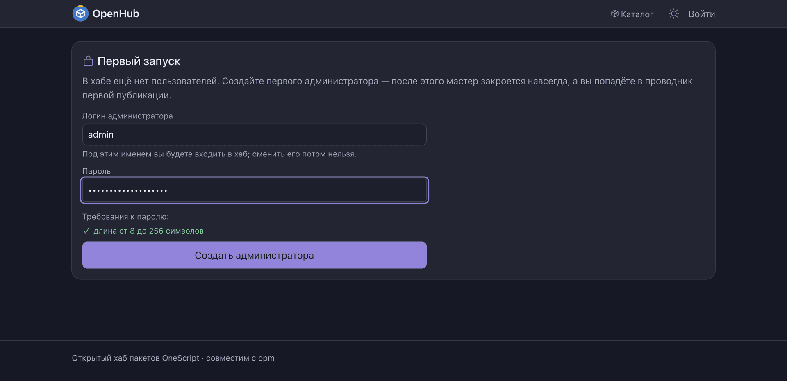
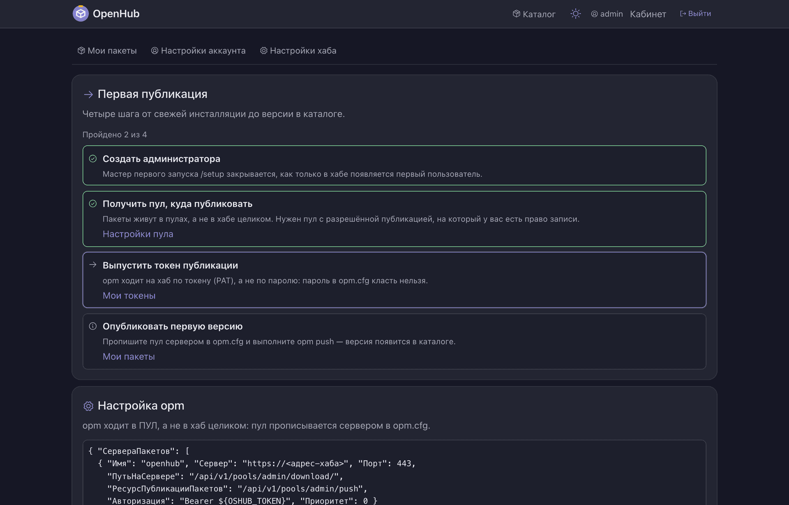
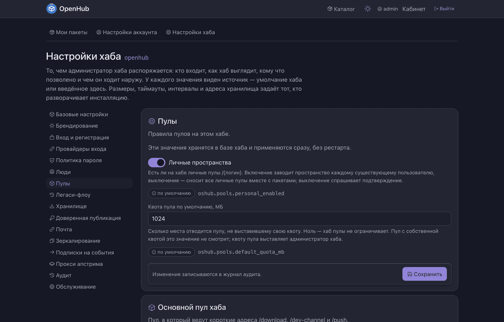
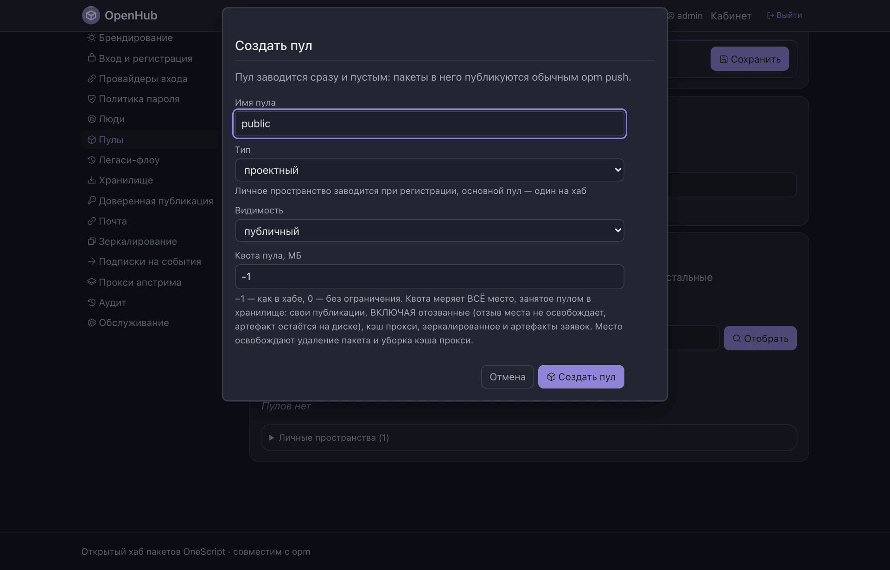
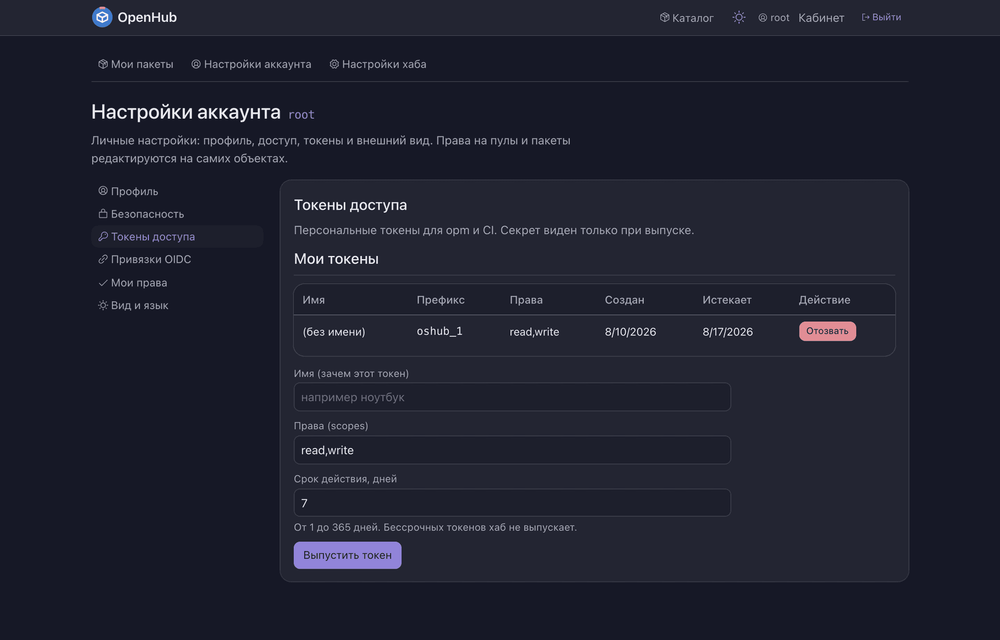
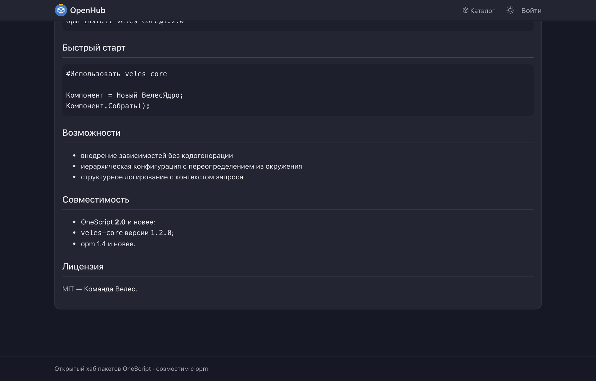

# Развёртывание

От пустой машины до первой опубликованной версии, минут за пятнадцать.

Нужен **OneScript 2.2.1+**. Внешних служб — базы, S3, почтового сервера — на этом пути
не понадобится: хаб поднимется на файловой базе рядом с собой.

---

## 1. Поставить хаб

```bash
opm install openhub
```

`opm` ставит хаб со всеми зависимостями и кладёт в `PATH` команду `openhub`.

Команда берёт настройки и складывает данные **в текущем каталоге**. Заведите хабу каталог:

```bash
mkdir ~/openhub && cd ~/openhub
```

Другие способы:

- **контейнер** — `docker run -d -p 3333:3333 -v openhub-data:/var/lib/openhub segateekb/openhub`.
  Шаг 2 не нужен: образ настроен на SQLite и файловое хранилище на томе.
  Подробности — [docker/README.md](../docker/README.md);
- **комплект для сервера** — каталог [deploy/](../deploy): хаб и PostgreSQL одной командой
  `docker compose up -d`. Настройки — в `autumn-properties.json` рядом, база и секреты —
  в секции `environment` файла `compose.yaml`.

## 2. Написать файл настроек

Положите рядом `autumn-properties.json` — минимальный рабочий файл: SQLite и файловое
хранилище в подкаталоге `./data`.

```json
{
    "winow": { "Порт": 3333 },
    "data": {
        "ИсточникиДанных": {
            "ТипКоннектора": "КоннекторSQLite",
            "СтрокаСоединения": "Data Source=./data/openhub.db"
        }
    },
    "oshub": {
        "storage": { "root": "./data" },
        "pools": { "default": "public" }
    }
}
```

| Ключ | Назначение |
| --- | --- |
| `winow.Порт` | порт HTTP-сервера |
| `data.ИсточникиДанных` | база: коннектор и строка соединения |
| `oshub.storage.root` | каталог данных: файлы пакетов и `аудит.log` |
| `oshub.pools.default` | имя основного пула — того, что отвечает на короткие адреса |

Схему базы хаб создаёт сам при первом старте.

**В файл кладут только то, что нужно до подключения к базе** — порт, базу, хранилище.
Остальное (режим регистрации, провайдеры входа, квоты, сроки токенов, поведение прокси)
настраивается в веб-интерфейсе и хранится в базе. Значение, заданное файлом, в интерфейсе
показано как «задано конфигурацией» и не редактируется.

**Секреты в файл не пишут**: пароли, ключи S3 и клиентские секреты OIDC передаются
переменными окружения или файлами-секретами.

Другая СУБД, переменные окружения, секреты, S3 — [справочник настроек](настройки.md).

## 3. Запустить

```bash
openhub
```

Хаб пишет в журнал ход старта и открывает порт последним — после строки
`Стартовые задачи завершены — открываю порт`. Готовность спрашивают у `/ready`, живость —
у `/health` ([пробы](эксплуатация.md#пробы)).

## 4. Завести первого администратора

Пока пользователей в базе нет, любая публичная страница уводит на **`/setup`**.


Логин и пароль. Логин не меняется — он же имя личного пространства.



Как только администратор появился, `/setup` закрывается навсегда.

### Развёртывание без рук

Плейбук заводит администратора переменными, мастер при этом не нужен:

```bash
OSHUB_ADMIN_LOGIN=admin OSHUB_ADMIN_PASSWORD__FILE=/run/secrets/openhub_admin openhub
```

Администратор создаётся при старте и обязан сменить пароль при первом входе.
`OSHUB_ADMIN_PASSWORD` со значением тоже работает, но значение переменной видно в списке
процессов; файл-секрет безопаснее.

## 5. Пройти проводник первой публикации

После мастера хаб открывает `/tour` — четыре шага от свежей инсталляции до версии в каталоге.
Шаг отмечается, когда он действительно сделан.



Первый шаг уже выполнен — администратор есть. Второй тоже: вместе с учёткой заведено личное
пространство, публиковать можно в него. Команде нужен общий пул.

## 6. Завести первый пул

Пакеты публикуются в конкретный пул; на свежем хабе пулов нет.



**Настройки хаба → Пулы** → «Создать пул».



Пул живёт по `/pools/{пул}`, пакет в нём — по `/pools/{пул}/packages/{пакет}`: пакет
`veles-core` в пуле `public` — `/pools/public/packages/veles-core`. Имя пула с адресами хаба
не пересекается, годится любое допустимое. Пул с именем из `oshub.pools.default` — **основной**:
на него отвечают короткие адреса `/download` и `/push`.

Квота `-1` — «как в хабе», `0` — без ограничения. Видимость и право публикации
переключаются в настройках самого пула.

## 7. Выпустить токен и опубликовать пакет

Пароль нужен браузеру; `opm` ходит по токену доступа.

Токен выпускается в кабинете: **Настройки аккаунта → Токены доступа**. У токена — имя,
права (`read` или `read,write`), срок от 1 дня до `oshub.auth.token.max_days` (365 по умолчанию)
и, при желании, рамка из пулов. Значение показывается один раз, при выпуске; каждый токен
отзывается отдельно. Токен не даёт больше, чем есть у его владельца. Конвейеру выпускают отдельный токен — только на запись в один пул.



`opm` из [oscript-library/opm#275](https://github.com/oscript-library/opm/pull/275) получает
токен сам: `opm login localhost:3333/public --browser` показывает короткий код, вход
подтверждается в кабинете, сервер прописывается в `opm.cfg`. Дальше:

```bash
opm build .
opm push --hub localhost:3333/public мойпакет-1.0.0.ospx
opm install localhost:3333/public/мойпакет
```

Выпущенный `opm` подключается записью в `opm.cfg`, которую хаб печатает на странице пакета
([совместимость с opm](../README.md#совместимость-с-opm)).

Опубликованная версия сразу видна в каталоге — с описанием из README пакета, версиями,
зависимостями и командой установки.



---

## Что настроить дальше

**Внешний адрес инсталляции.** Настройки хаба → Базовые настройки → «URL инстанса». Из него
хаб считает адрес возврата для провайдеров входа и аудиторию доверенной публикации; пока он
пуст, не работает ни то ни другое.

**Хаб, который opm знает по умолчанию.** Настройки хаба → Базовые настройки → «opm знает
этот хаб по умолчанию». Включают там, где `opm` ходит без настройки клиента: у пакетов
основного публичного пула хаб перестаёт печатать запись для `opm.cfg`, а подсказки публикации —
просить прописать хаб. Публикация в основной пул идёт опциями:
`opm push --token <токен> -c stable мойпакет-1.0.0.ospx` (без `opm.cfg` канал `opm` определяет
сам только в git-репозитории на ветке `master`). Пакетам других пулов и приватного
основного пула запись в `opm.cfg` нужна.

**Дальше:**

- [вход через корпоративный SSO](вход-через-провайдера.md);
- [источники пула](кэширующий-прокси.md) — публичные пакеты через ваш хаб;
- [доверенная публикация](доверенная-публикация.md) — CI публикует без секрета;
- [теги](теги-и-каналы.md) — что ставит `opm install` без версии;
- [настройки](настройки.md) — S3, другая СУБД, кэши, журнал, OpenTelemetry;
- [эксплуатация](эксплуатация.md) — обратный прокси, пробы, страна посетителя, прокси для Telegram;
- [HTTP API](http-api.md) — описание OpenAPI и списки.
