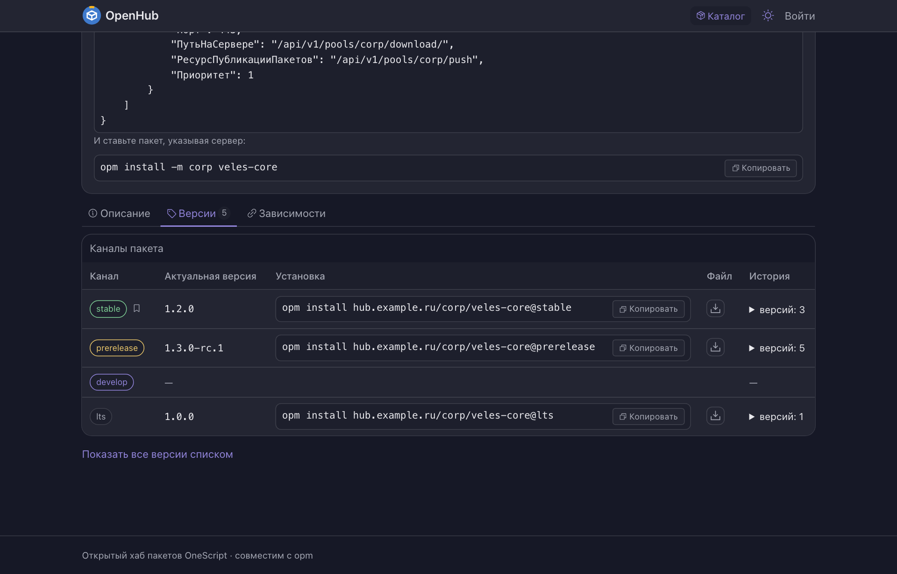
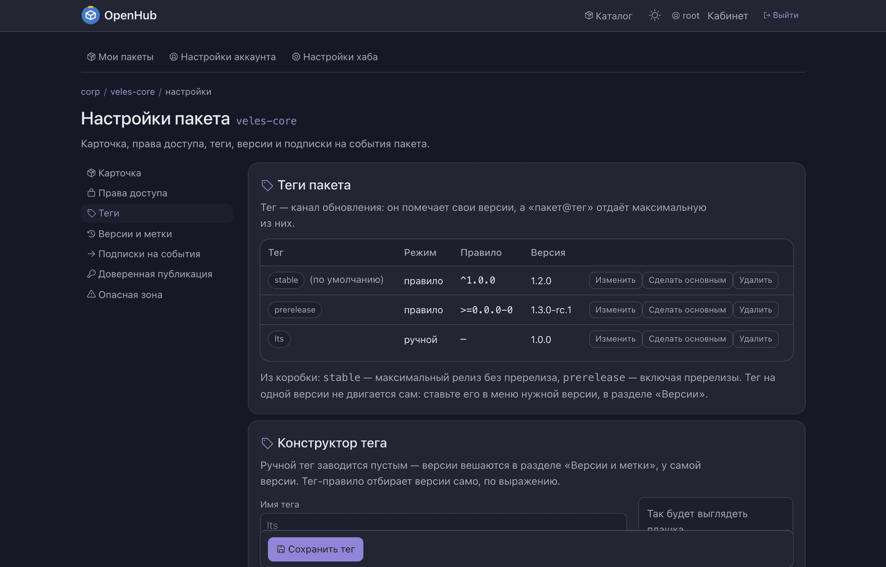

# Что такое теги и каналы

Короткий ответ: **это одно и то же.** Отдельной сущности «канал» в хабе нет — заводится,
настраивается и адресуется тег. «Канал обновления» — не второй объект рядом с тегом,
а то, чем тег является: он помечает набор версий и потому со временем меняет то,
что отдаёт.

---

## Как это работает

У тега есть **состав** — все версии, которые он помечает. Установка по тегу берёт
из состава максимальную по порядку версий:

```bash
opm install hub.example.ru/corp/veles-core@stable
```

Публикуется версия **в общий поток версий пакета**, а не «в тег»: привязки публикации
к тегу нет. Тег отвечает на вопрос «что под ним сейчас», а не «что когда-либо было» —
истории прошлых правил он не хранит.

Одно решение о публикации тег всё же принимает — [можно ли переиздать уже опубликованный
номер](#запрет-повторной-публикации-номера).

Тег принадлежит **пакету**, а не пулу: `stable` у двух пакетов одного пула — это два
разных обещания. Пакет, заведённый позже соседей, одноимённый тег не наследует.



Вкладка версий показывает это двумя представлениями, и они отвечают на разные вопросы.
«Каналы пакета» — что тег отдаёт **сейчас** и какой командой это поставить; состав
раскрывается «Историей». Плоский список версий — что и когда вообще публиковалось.

---

## Каналов «из коробки» нет — есть кнопка

**Хаб не заводит тегов сам.** Новый пакет рождается без каналов: `пакет@stable` у него
отвечает «нет такого» ровно так же, как любое незаведённое имя, и раздел «Теги» честно
показывает пустоту. Незаведённого канала не существует — предопределённых правил,
работающих «за» отсутствующий тег, в хабе нет.

Вместо них — **визард**. Настройки пакета → **Теги** → кнопка «Создать каналы
„по умолчанию“». Она открывает окно, где перечислено, что именно будет заведено:

| Канал | Что в нём | Правило |
| --- | --- | --- |
| `stable` | версии **без предрелизного суффикса**: `1.2`, `1.2.3`, `1.2.3.4`, `1.0.0+build.5` | `^[0-9]+(\.[0-9]+)?(\.[0-9]+)?(\.[0-9]+)?(\+[0-9A-Za-z.-]+)?$` |
| `prerelease` | то же плюс предрелизы-кандидаты `-rc`: `2.0.0-rc.1`, `2.0.0-rc.1+meta` | `^[0-9]+(\.[0-9]+)?(\.[0-9]+)?(\.[0-9]+)?(-rc[0-9A-Za-z.-]*)?(\+[0-9A-Za-z.-]+)?$` |
| `develop` | всё остальное: `-alpha`, `-beta`, `-dev`, прочие предрелизные суффиксы и строки вне порядка версий вроде `SNAPSHOT` | `^(?![0-9]+(\.[0-9]+)?(\.[0-9]+)?(\.[0-9]+)?(-rc[0-9A-Za-z.-]*)?(\+[0-9A-Za-z.-]+)?$).+$` |

**«Стабильная» здесь — версия без предрелизного суффикса, а не «ровно три числа».**
Четырёхкомпонентный номер (`1.2.3.4`) — обычный для экосистемы OneScript релиз, и `stable`,
становясь основным тегом, обязан его отдавать: иначе кнопка ломала бы `opm install <пакет>`
пакету, который до неё прекрасно ставился.

**Регистр значим** — как у любого правила тега. `2.0.0-RC1` под `-rc` не подходит и попадает
в `develop`. Правила визарда — обычные правила: конвейеру, который пишет кандидаты
заглавными, достаточно один раз поправить выражение `prerelease`.

Заведение идемпотентно: канал, который у пакета уже есть, визард не трогает вовсе —
правило, которое вы изменили, обратно не переопределяется. `stable` при этом становится
основным тегом, если основного ещё не было.

**У `develop` переиздание номеров разрешено с рождения** — единственное исключение из
[запрета повторной публикации](#запрет-повторной-публикации-номера). Ночные сборки
переиздаются под тем же номером, и конвейеру не нужен `--force`.

Имя, которое у пакета уже занято **номером версии** (так бывает у пакетов, зазеркаленных
до появления запрета), визард пропускает и заводит остальные.

> **`latest` не предлагается.** Он был копией `stable` — тем же правилом под другим
> именем, — и держать два имени для одного обещания незачем. Имя при этом не
> зарезервировано: нужен `latest` — заведите руками.

### Пул может заводить каналы сам

Настройки пула → **Теги** → тумблер «Каналы „по умолчанию“ новым пакетам».
**Выключен, пока его не включили.** На включённом пакет этого пула получает те же три
канала на первой же версии — и своей, и привезённой с апстрима; ядро у визарда и у
автоматики одно, поэтому составы каналов совпадают. Пакета, у которого канал уже есть,
настройка не касается: удалённый вами канал следующей публикацией не вернётся.

Пока настройка выключена, привезённый зеркалом пакет каналов не получает — `пакет@stable`
у него отвечает «нет такого», пока каналы не заведут.

### Когда канала нет

Отказ называет и незаведённое имя, и то, что у пакета заведено:

```text
Тег "stabel" у пакета "veles-core" не заведён. Заведены: develop, prerelease, stable
```

Одинаково отвечают адрес резолва, канальный путь выдачи и запрос файла со спецификацией.
Похожее имя хаб не угадывает — он показывает список и оставляет выбор человеку.

### Легаси-адрес `/dev-channel`

Старый адрес `/dev-channel/<пакет>/<файл>` спрашивает канал по имени `dev`, и хаб понимает
его как **строку тега `prerelease`**. Что изменилось:

- **у пакета без каналов адрес отвечает 404.** Раньше он отвечал всегда — предопределённым
  правилом, работавшим «за» отсутствующий тег. Теперь незаведённого канала не существует,
  и `/dev-channel` подчиняется общему правилу;
- **у пакета с каналами адрес ведёт на строку тега `prerelease`** — со всем составом, какой
  задал мейнтейнер. Это улучшение: прежде алиас резолвился предопределённым правилом
  и **игнорировал** правку `prerelease`, то есть мог отдать не ту версию, которую канал
  показывает на экране;
- собственный тег с именем `dev` (его можно завести руками) старше алиаса: сначала ищется
  он, и только потом `prerelease`.

### Пул-прокси: безверсионный путь ходит к апстриму

У пула с апстримами безверсионный запрос (`opm install <пакет>` без версии и без тега)
идёт по своей лестнице: сначала объединённый набор версий — свои и те, что называют
источники, — и лишь потом местный индекс. Поэтому **зазеркаленный пакет ставится
и без единого местного канала**: версию называет апстрим. Правило «нет тега — нет резолва»
касается адресации ПО ИМЕНИ канала (`пакет@stable`, `/channels/<имя>/…`), а не безверсионной
установки. Это осознанное поведение прокси, а не дыра в правиле.

> **Оговорка: на прокси двери расходятся.** У зазеркаленного пакета без местных каналов
> `/pools/<пул>/channels/stable/download/<пакет>/<пакет>.ospx` (и то же с `latest`) отдаёт
> **200**: канальный сегмент до апстрима не доезжает, и лестница выдачи берёт его
> безверсионный файл. А `resolve?spec=stable` по тому же пакету отвечает **404** — резолв
> честно говорит, что канала нет. Это легаси-поведение прокси, доставшееся от прежней
> лестницы; займёмся отдельно, если владелец сочтёт нужным. Полагаться на первое как
> на «канал работает» не стоит: имени канала там нет ни у нас, ни у апстрима.

---

## Основной тег: что ставится без имени тега

**Ровно один тег пакета помечен основным**, и именно он отвечает на безверсионный запрос:

```bash
opm install hub.example.ru/corp/veles-core     # ← основной тег пакета
```

Основным становится `stable`, которого завёл визард, — но это начальное значение,
а не запрет менять: пометка переносится с тега на тег кнопкой «Сделать основным».
Двух основных у пакета не бывает.

У пакета, которому каналов не заводили вовсе, безверсионный запрос обслуживает фолбэк
«последняя версия»: он привозит максимальный релиз и никогда — предрелиз или `SNAPSHOT`.
Каналом он не является и по имени не адресуется.

Смысл в том, что `opm install <пакет>` привозит то, что **мейнтейнер считает пригодным
к употреблению**, а не самое свежее, что у него собралось. Хотите ставить предрелизы —
скажите это явно: `пакет@prerelease`.

Обращение вида «версия 1.4» разрешается в максимум внутри `1.4.x` — отдельным тегом
такие сокращения не заводятся.

---

## Завести свой тег

Настройки пакета → **Теги**.



У тега два режима, и выбирать между ними приходится один раз:

**Ручной.** Версии под тегом помечает человек, и их может быть несколько. Тег заводится
пустым, а версии вешаются в разделе «Версии и метки», у самой версии. Так делают `lts`
или пин под конкретного заказчика: закрепить одну версию — это отдельный тег на этой
версии, а не исключение внутри существующего.

**Правило.** Состав — результат отбора по версиям пакета: выражением о версиях (`^1.0.0`,
`>=2.0.0 <3.0.0`) либо, для сложных случаев, шаблоном по строке версии. Шаблон сличается
с версией **целиком и с учётом регистра**: строка версии — это данные, а не текст
для человека.

Что стоит знать про правила:

- **смена правила меняет состав сразу** — снимать и пересчитывать нечего;
- **что поймает правило, видно по ходу ввода**: конструктор рисует список версий-кандидатов
  живой плашкой — включая отозванные (с пометкой) и ту, в которую пойдёт установка.
  Отдельного шага «сначала посмотри предпросмотр, потом сохраняй» нет;
- правило, ничем не ограниченное с краёв, сопровождается предупреждением;
- **снять версию с тега-правила нельзя**: состав правила — это функция, и кнопки,
  которая гарантированно ошибается, в интерфейсе нет;
- перевод тега из ручного режима в правило **снимает набранные вручную метки** — иначе
  они пережили бы смену режима.

### Вид тега

У тега выбирается стиль и значок — **из закрытого списка**, произвольного цвета нет
ни в каком виде. Выбранный вид виден в конструкторе до сохранения и работает там, где
тег видит читатель: на публичной странице пакета, во вкладке версий и в строке версии.

Стиль сам подстраивается под светлую и тёмную тему: выбирается смысл, а не краска,
поэтому смена оформления хаба данных не трогает.

---

## Запрет повторной публикации номера

**Опубликованный номер второй раз не публикуется.** Push той же версии получает конфликт
(409) — независимо от того, релиз это, пререлиз или SNAPSHOT, и что стоит в заголовке
`CHANNEL`. Причина в том, что номер уже установлен у людей: молча подменить его байты
значит сломать сборку тому, кто вчера поставил эту версию.

Держит запрет **тег**: у каждого тега есть тумблер «Запрет повторной публикации»,
и он **включён по умолчанию** — у новых тегов, у заведённых визардом `stable`
и `prerelease` и у тегов, заведённых до появления этой настройки. Единственное
исключение — `develop`: визард заводит его с уже снятым запретом, потому что ночные
сборки переиздаются под одним номером. Номер запрещён, если под запретом
хотя бы один тег, под который он попадает. Версия, не попавшая **ни под один** тег
(так выглядит голый `SNAPSHOT`: semver-правила его не ловят), тоже запрещена — снимать
запрет там просто не с чего.

Выходов два:

- **заменить номер явно** — добавить к адресу push параметр `?force=1`
  (`POST /api/v1/pools/<пул>/push?force=1`); в новых версиях клиента это будет
  `opm push --force`. Замена меняет номер целиком: байты, карточку и состав зависимостей, —
  и остаётся в журнале аудита отдельным действием «перезапись версии» с пометкой форса.
  Отдельного права у замены нет: форсит тот, кто и так вправе публиковать;
- **снять запрет с тега** — тумблером в конструкторе тега либо полем `overwrite_allowed`
  в API тега (`PUT /api/v1/pools/<пул>/packages/<имя>/tags/<тег>`). Тогда номера этого
  канала переиздаются свободно, без всякого форса. В таблице тегов такой канал помечен:
  «переиздание номеров разрешено».

Форс снимает **только** этот запрет. Негодная строка версии и номер, который пакет уже
понимает как имя тега, отвергаются с ним ровно так же.

Зеркала и кэширующие прокси всё это не касается: привезённая с апстрима версия
не перезаписывается вовсе — она либо новая, либо уже известна.

---

## Отозванные версии

Отзыв версии **метку не снимает**: версия остаётся видна в составе тега и помечена
отозванной — человек должен понимать, почему тег «пропустил» её.

А вот установка по тегу берёт максимальную среди **не отозванных**. Если под тегом
отозваны все версии, он не резолвится вовсе — отозванную не отдаёт. Отсев работает
одинаково на всех путях выдачи: тег, диапазон, безверсионный запрос.

Скачать отозванную версию по точной координате по-прежнему можно — с предупреждением.

---

## Чего пока нет

**Правила хранения («держим последние N») нет.** Механизм отложен целиком, и не
случайно: удаление версии как таковое запрещено — версия отзывается, но не чистится.
Правило хранения устроено так, что удаляет версии, то есть упирается прямо в этот запрет.
Вернуться к нему можно, только начав с вопроса «а можно ли вообще удалять».

**У `opm` ещё нет ключа `--force`.** Клиентская половина замены номера лежит в апстриме
и пока не выпущена, поэтому сегодня замена делается параметром адреса `?force=1` —
хабом она поддержана полностью, на всех адресах публикации.
