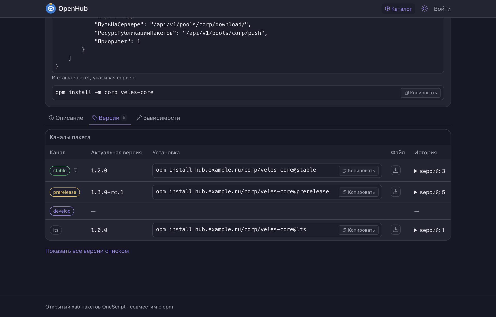

# Теги и каналы

Короткий ответ: **это одно и то же.** Отдельной сущности «канал» в хабе нет — заводится,
настраивается и адресуется тег. «Канал обновления» — не второй объект рядом с тегом,
а то, чем тег является: он помечает набор версий и потому со временем меняет то,
что отдаёт.

---

## Как это работает

У тега есть **состав** — все версии, которые он помечает. Установка по тегу берёт
из состава максимальную по порядку версий:

```bash
opm install hub.example.ru/corp/veles-core@stable
```

Какой `opm` понимает такую адресную форму и как подключить выпущенный —
[совместимость с opm](../README.md#совместимость-с-opm).

Публикуется версия **в общий поток версий пакета**, а не «в тег»: привязки публикации
к тегу нет. Тег отвечает на вопрос «что под ним сейчас», а не «что когда-либо было» —
истории прошлых правил он не хранит.

Одно решение о публикации тег всё же принимает — [можно ли переиздать уже опубликованный
номер](#запрет-повторной-публикации-номера).

Тег принадлежит **пакету**: `stable` у двух пакетов одного пула — это два разных обещания,
даже когда правило у них одно. Пул может описать набор тегов один раз для всех своих
пакетов — [теги пула](#теги-пула): пакет наследует их, а свой тег с тем же именем заменяет
тег пула.



Вкладка версий показывает это двумя представлениями, и они отвечают на разные вопросы.
«Каналы пакета» — что тег отдаёт **сейчас** и какой командой это поставить; состав
раскрывается «Историей». Плоский список версий — что и когда вообще публиковалось.

Колонка «Файл» в обоих представлениях отдаёт `.ospx` файлом: у канала — ту версию, которую
он отдаёт в момент клика, в плоском списке — ровно версию своей строки. Скачанный файл
ставится командой `opm install -f <файл>`.

---

## Каналов «из коробки» нет — есть кнопка

**Хаб не заводит тегов сам.** Новый пакет рождается без каналов: `пакет@stable` у него
отвечает «нет такого» ровно так же, как любое незаведённое имя, и раздел «Теги» пуст. Незаведённого канала не существует — предопределённых правил,
работающих «за» отсутствующий тег, в хабе нет.

Вместо них — **визард**. Настройки пакета → **Теги** → кнопка «Создать каналы
„по умолчанию“». Она открывает окно, где перечислено, что именно будет заведено:

| Канал | Что в нём | Правило |
| --- | --- | --- |
| `stable` | версии **без предрелизного суффикса**: `1.2`, `1.2.3`, `1.2.3.4`, `1.0.0+build.5` | `^[0-9]+(\.[0-9]+)?(\.[0-9]+)?(\.[0-9]+)?(\+[0-9A-Za-z.-]+)?$` |
| `prerelease` | то же плюс предрелизы-кандидаты `-rc`: `2.0.0-rc.1`, `2.0.0-rc.1+meta` | `^[0-9]+(\.[0-9]+)?(\.[0-9]+)?(\.[0-9]+)?(-rc[0-9A-Za-z.-]*)?(\+[0-9A-Za-z.-]+)?$` |
| `develop` | всё остальное: `-alpha`, `-beta`, `-dev`, прочие предрелизные суффиксы и строки вне порядка версий (`NIGHTLY` сюда попадает). Слот `SNAPSHOT` — изъятие: он сюда не попадает | `^(?!(?i:SNAPSHOT)$)(?![0-9]+(\.[0-9]+)?(\.[0-9]+)?(\.[0-9]+)?(-rc[0-9A-Za-z.-]*)?(\+[0-9A-Za-z.-]+)?$).+$` |

**Слот `SNAPSHOT` ни в один канал визарда не попадает.** Его содержимое у источника
меняется — сегодня одна сборка, завтра другая, — и каналом обновления он не является:
`pkg@develop` не имеет права однажды привезти вчерашнюю ночную сборку под тем же номером.
Кому снапшот в канале нужен, тот заводит тег правилом `regex` `^(?i:SNAPSHOT)$` руками,
и такой тег его действительно отдаёт. Написание с `(?i:…)` ловит слот в любом регистре —
как и изъятие в `develop`; правило `^SNAPSHOT$` строчный `snapshot` пропустит, а зеркало
такой слот заменяет наравне.

Изъятие — **ровно слот и в любом написании**: `snapshot` и `Snapshot` в `develop` тоже
не попадают, потому что у источника это одна и та же вещь.

**«Стабильная» здесь — версия без предрелизного суффикса, а не «ровно три числа».**
Четырёхкомпонентный номер (`1.2.3.4`) — обычный для экосистемы OneScript релиз, и `stable`,
становясь основным тегом, отдаёт и его.

**Регистр значим** — как у любого правила тега. `2.0.0-RC1` под `-rc` не подходит и попадает
в `develop`, как и строки вне порядка версий вроде `NIGHTLY`. Правила визарда — обычные
правила: конвейеру, который пишет кандидаты заглавными, достаточно поправить выражение
`prerelease`.

Заведение идемпотентно: канал, который у пакета уже есть, визард не трогает вовсе —
правило, которое вы изменили, обратно не переопределяется. `stable` при этом становится
основным тегом, если основного ещё не было.

**У `develop` переиздание номеров разрешено с рождения** — единственное исключение из
[запрета повторной публикации](#запрет-повторной-публикации-номера). Ночные сборки
переиздаются под тем же номером, и конвейеру не нужен `--force`.

Имя, которое у пакета уже занято **номером версии**, визард пропускает и заводит остальные.

`latest` визард не заводит; имя не зарезервировано, такой тег заводится руками.

Визард нужен пакету, у которого тегов нет вовсе. Пакету пула с включёнными
[тегами пула](#теги-пула) каналы уже даёт пул, и кнопки у него нет.

### Когда канала нет

Отказ называет и незаведённое имя, и то, что у пакета заведено:

```text
Тег "stabel" у пакета "veles-core" не заведён. Заведены: develop, prerelease, stable
```

Одинаково отвечают адрес резолва, канальный путь выдачи и запрос файла со спецификацией.
Похожее имя хаб не угадывает — он показывает список и оставляет выбор человеку.

### Адрес `/dev-channel`

`/dev-channel/<пакет>/<файл>` спрашивает канал `dev`: сначала собственный тег пакета `dev`,
если он заведён, затем тег `prerelease` со всем его составом. У пакета без этих тегов
адрес отвечает 404.

### Пул-прокси: безверсионный путь ходит к апстриму

У пула с апстримами безверсионный запрос (`opm install <пакет>` без версии и без тега)
идёт по своей лестнице: сначала объединённый набор версий — свои и те, что называют
источники, — и лишь потом местный индекс. Поэтому **зазеркаленный пакет ставится
и без единого местного канала**: версию называет апстрим. Правило «нет тега — нет резолва»
касается адресации ПО ИМЕНИ канала (`пакет@stable`, `/channels/<имя>/…`), а не безверсионной
установки.

У зазеркаленного пакета без местных каналов канальный путь
`/pools/<пул>/channels/stable/download/<пакет>/<пакет>.ospx` (и то же с `latest`) отдаёт
безверсионный файл источника, а `resolve?spec=stable` по тому же пакету отвечает 404:
канала `stable` у пакета нет. Ответ канального пути признаком заведённого канала не служит.

---

## Теги пула

Настройки пула → **Теги** → галка «Теги пула для пакетов». **Выключена, пока её не
включили.** Включённая галка открывает в том же разделе набор тегов пула и конструктор
тега пула, и каждый пакет пула — свой и привезённый с апстрима — отдаёт эти теги,
ничего не заводя у себя:

```bash
opm install hub.example.ru/corp/veles-core@stable   # тег пула corp
```

- **Первое включение** заполняет набор тремя каналами визарда — `stable`, `prerelease`,
  `develop` с теми же правилами; `stable` становится основным тегом пула. Дальше набор
  правит владелец пула, и повторное включение галки его не трогает.
- **У пула только теги-правила**: диапазон semver или регулярное выражение по строке
  версии, со стилем, значком, пометкой основного и запретом повторной публикации. Ручной
  состав ведут у пакета.
- **Правка тега пула доезжает до пакетов сразу** — без публикации и без перезаписи пакетов.
- Пакет, которого в пуле с апстримами ещё нет, тоже отдаёт теги пула: первый
  `opm install <пакет>@<тег пула>` выбирает по правилу тега среди версий источника.
- **Галку сняли** — пакеты тегов пула больше не видят, у них остаются только свои теги;
  набор пула хранится и вернётся с галкой.
- Правят набор и галку те, кто администрирует пул. Издатель и читатель пула раздела не
  видят.

### Тег пула у пакета

В разделе «Теги» настроек пакета столбец «Откуда» говорит, чей тег: **свой**, **от пула**,
**перекрывает пул** или **выключен у пакета**.

- **Правка унаследованного тега заводит у пакета копию** с правкой — тег пула не меняется,
  соседние пакеты его видят по-прежнему. Копия с тем же именем заменяет тег пула целиком:
  правка тега пула до этого пакета больше не доезжает.
- **«Вернуть тег пула»** снимает копию, и пакет снова видит тег пула.
- **«Выключить у пакета»** убирает тег пула у этого пакета: его нет ни в `пакет@тег`,
  ни на странице пакета, ни в отборе подписок. «Включить снова» его возвращает.
- Править и выключать тег у пакета может тот, кто ведёт теги пакета.

Своя копия остаётся тегом пакета и тогда, когда тег пула удалили.

### Имя тега пула и номера версий

Имя тега пула не совпадает с номером версии ни одного пакета пула: тег с таким именем
не заводится, а номер, совпавший с именем тега пула, не принимает ни push, ни зеркало,
ни прокси — при любом положении галки.

### Теги пула в API

| Что | Адрес |
| --- | --- |
| галка | `PATCH /api/v1/pools/<пул>/settings` с полем `pool_tags`; читается в `GET` того же адреса |
| набор пула | `GET /api/v1/pools/<пул>/tags` — теги и `enabled` |
| тег пула | `PUT /api/v1/pools/<пул>/tags/<тег>` с `rule`, `ruleType`, `style`, `icon`, `default`, `overwrite_allowed`; `DELETE` того же адреса |
| теги пакета | `GET /api/v1/pools/<пул>/packages/<имя>/tags` — у каждого `origin` (`свой`, `пул`, `перекрывает`), выключенные — в `disabled` |
| выключение у пакета | `PUT /api/v1/pools/<пул>/packages/<имя>/tags/<тег>/disabled`; `DELETE` возвращает |

`PUT …/packages/<имя>/tags/<тег>` с именем тега пула заводит копию, `DELETE` копии
возвращает тег пула; `DELETE` унаследованного тега без копии отвечает `422 tag_inherited`.

---

## Основной тег: что ставится без имени тега

**Ровно один тег пакета помечен основным**, и именно он отвечает на безверсионный запрос:

```bash
opm install hub.example.ru/corp/veles-core     # ← основной тег пакета
```

Основным становится `stable`, которого завёл визард, — но это начальное значение,
а не запрет менять: пометка переносится с тега на тег действием «Сделать основным»
в меню строки (шестерёнка справа). Двух основных у пакета не бывает.

Основной тег пула — основной у каждого пакета пула, пока у пакета нет своего основного.
Пометка тега пакета основным (у унаследованного тега — копией) перебивает пул.

В таблице тегов основной канал видно сразу: его строка залита цветом, а в её начале —
отдельным столбцом — стоит значок-закладка с подписью «Канал по умолчанию». У остальных
строк этот столбец пуст.

У пакета, которому каналов не заводили вовсе, безверсионный запрос обслуживает фолбэк
«последняя версия»: он привозит максимальный релиз и никогда — предрелиз или `SNAPSHOT`.
Каналом он не является и по имени не адресуется.

Смысл в том, что `opm install <пакет>` привозит то, что **мейнтейнер считает пригодным
к употреблению**, а не самое свежее, что у него собралось. Хотите ставить предрелизы —
скажите это явно: `пакет@prerelease`.

Обращение вида «версия 1.4» разрешается в максимум внутри `1.4.x` — отдельным тегом
такие сокращения не заводятся.

---

## Завести свой тег

Настройки пакета → **Теги**.


У тега два режима, и выбирать между ними приходится один раз:

**Ручной.** Версии под тегом помечает человек, и их может быть несколько. Тег заводится
пустым, а версии вешаются в разделе «Версии и метки», у самой версии. Так делают `lts`
или пин под конкретного заказчика: закрепить одну версию — это отдельный тег на этой
версии, а не исключение внутри существующего.

**Правило.** Состав — результат отбора по версиям пакета: выражением о версиях (`^1.0.0`,
`>=2.0.0 <3.0.0`) либо, для сложных случаев, шаблоном по строке версии. Шаблон сличается
с версией **целиком и с учётом регистра**: строка версии — это данные, а не текст
для человека.

Что стоит знать про правила:

- **смена правила меняет состав сразу** — снимать и пересчитывать нечего;
- **что поймает правило, видно по ходу ввода**: конструктор рисует список версий-кандидатов
  живой плашкой — включая отозванные (с пометкой) и ту, в которую пойдёт установка.
  Отдельного шага «сначала посмотри предпросмотр, потом сохраняй» нет;
- правило, ничем не ограниченное с краёв, сопровождается предупреждением;
- **снять версию с тега-правила нельзя**: состав правила — это функция, и кнопки,
  которая гарантированно ошибается, в интерфейсе нет;
- перевод тега из ручного режима в правило **снимает набранные вручную метки** — иначе
  они пережили бы смену режима.

### Вид тега

У тега выбирается стиль и значок — **из закрытого списка**, произвольного цвета нет
ни в каком виде. Выбранный вид виден в конструкторе до сохранения и работает там, где
тег видит читатель: на публичной странице пакета, во вкладке версий и в строке версии.

Стиль сам подстраивается под светлую и тёмную тему: выбирается смысл, а не краска,
поэтому смена оформления хаба данных не трогает.

---

## Запрет повторной публикации номера

**Опубликованный номер второй раз не публикуется.** Push той же версии получает конфликт
(409) — независимо от того, релиз это, пререлиз или `SNAPSHOT`, и что стоит в заголовке
`CHANNEL`. Причина в том, что номер уже установлен у людей: молча подменить его байты
значит сломать сборку тому, кто вчера поставил эту версию.

Держит запрет **тег**: у каждого тега есть тумблер «Запрет повторной публикации»,
и он **включён по умолчанию** — у новых тегов и у заведённых визардом `stable`
и `prerelease`. Единственное
исключение — `develop`: визард заводит его с уже снятым запретом, потому что ночные
сборки переиздаются под одним номером. Номер запрещён, если под запретом
хотя бы один тег, под который он попадает. Версия, не попавшая **ни под один** тег,
тоже запрещена — снимать запрет там просто не с чего. Теги пула, которые пакет
наследует, считаются наравне с его собственными.

**Слот `SNAPSHOT`** не попадает ни в один канал визарда, поэтому повторный
`opm push <пакет> SNAPSHOT` получает 409. Чтобы переиздавать слот у себя, заводят канал
правилом `regex` `^(?i:SNAPSHOT)$` и снимают у него запрет повторной публикации — либо
публикуют с `?force=1`. Копия чужого слота при зеркалировании идёт за оригиналом сама.

Выходов два:

- **заменить номер явно** — добавить к адресу push параметр `?force=1`
  (`POST /api/v1/pools/<пул>/push?force=1`; работает на всех адресах публикации, у выпущенного
  `opm` ключа `--force` нет). Замена меняет номер целиком: байты, карточку и состав зависимостей, —
  и остаётся в журнале аудита отдельным действием «перезапись версии» с пометкой форса.
  Отдельного права у замены нет: форсит тот, кто и так вправе публиковать;
- **снять запрет с тега** — тумблером в конструкторе тега либо полем `overwrite_allowed`
  в API тега (`PUT /api/v1/pools/<пул>/packages/<имя>/tags/<тег>`). Тогда номера этого
  канала переиздаются свободно, без всякого форса. В таблице тегов такой канал помечен:
  «переиздание разрешено».

Форс снимает **только** этот запрет. Негодная строка версии и номер, который пакет уже
понимает как имя тега, отвергаются с ним ровно так же.

Зеркала и кэширующие прокси всё это не касается: привезённая с апстрима версия
не перезаписывается вовсе — она либо новая, либо уже известна.

---

## Отозванные версии

Отзыв версии **метку не снимает**: версия остаётся видна в составе тега и помечена
отозванной — человек должен понимать, почему тег «пропустил» её.

А вот установка по тегу берёт максимальную среди **не отозванных**. Если под тегом
отозваны все версии, он не резолвится вовсе — отозванную не отдаёт. Отсев работает
одинаково на всех путях выдачи: тег, диапазон, безверсионный запрос.

Скачать отозванную версию по точной координате можно — с предупреждением.

Удалить версию нельзя — только отозвать.
