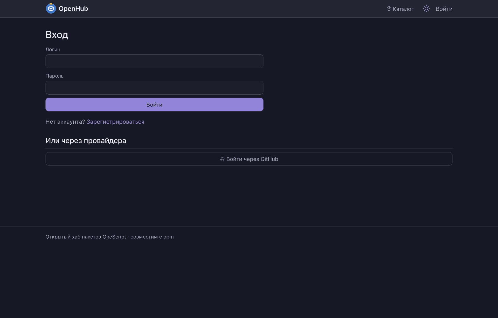

# Вход

Здесь лежит всё, чем человек или программа доказывает хабу, кто она: пароль, внешний
провайдер, ключ доступа, сессия, — и всё, что происходит с учётной записью до первого
права. На вопрос «а что тебе можно» отвечает соседний модуль [`права`](../права/README.md).

Подкаталоги названы способами входа, а не видами классов: искать удобнее «как устроен вход
паролем», чем «где тут политики».

| Каталог | Что внутри | Где видно |
| --- | --- | --- |
| `учётки/` | жизнь учётной записи: заведение и поиск, нормализация логина, адрес почты и доказательство владения им, признак активности, удаление со всеми следами, события безопасности в журнал | «Настройки хаба» → «Люди» · `/api/v1/users` |
| `паролем/` | проверка логина и пароля, требования к паролю, лимит попыток, выключатель парольного входа, самостоятельное восстановление по письму | `/login` · `POST /api/v1/login` |
| `подтверждение-адреса/` | цикл ссылки подтверждения: срок, выпуск и разбор секрета, публичная страница, коды отказов, текст письма | `/confirm-email` |
| `регистрация/` | как появляется учётка: режим хаба (открытая регистрация, по приглашению, закрытая), мастер первого запуска, одноразовая ссылка установки пароля и её погашение | `/register` · `/setup` · `/invite` |
| `сессии/` | серверная сессия: модель и срок со скользящим продлением, хранение в базе, токен CSRF | кука сессии |
| `ключи/` | ключи доступа (PAT): выпуск и отзыв, сужение прав рамками ключа, отдельная проверка самого ключа | `/api/v1/tokens` · заголовок `Authorization` |
| `из-cli/` | вход из командной строки по RFC 8628: пара кодов, подтверждение человеком в браузере, опрос клиентом | `opm login --browser` |
| `провайдером/` | вход через внешнего провайдера: пресеты и конфигурация, провайдеры из базы и из окружения, транзакции OIDC, связка «учётка ↔ внешняя личность», автопривязка профиля | `/login/oidc/{провайдер}` · `/oidc/callback` |
| `на-входе/` | обвязка каждого запроса: контроллер `/api/v1`, определение личности запроса, единый формат отказов | все запросы к хабу |

Способы входа друг друга не исключают: учётная запись одна, а войти в неё можно и паролем,
и через провайдера. Парольный вход при этом администратор вправе выключить целиком, оставив
только внешних провайдеров.

*Пароль и внешние провайдеры на одной странице входа.*

Соседям модуль отдаёт готовый ответ «кто это» — им пользуются `права`, `api`, `публикация`
и экраны. Сам он берёт значения политик — сроки, режимы, сложность пароля — у `настройки`,
письма отправляет через `уведомления`, а страницы входа и регистрации рисует `интерфейс`.

Словарь хаба — пулы, пакеты, версии — объясняет [корневой README](../../../README.md).
