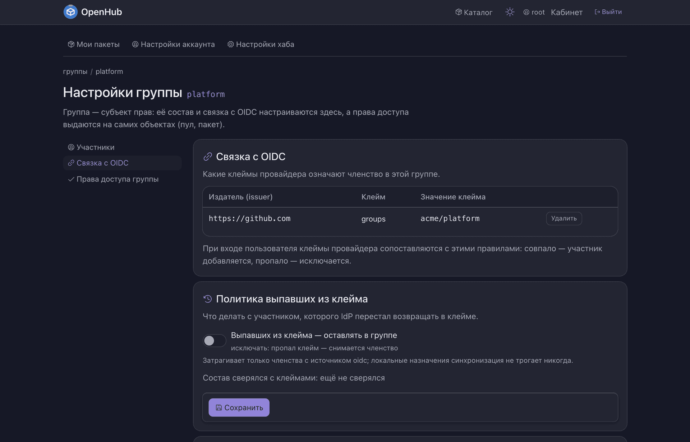

# Права

Модель прав хаба и всё, что её кормит. Кто пришёл — отвечает соседний модуль
[`вход`](../вход/README.md); сюда приходят уже с известной личностью и спрашивают,
что ей можно.

Права спрашивают многие — `api`, `кабинет`, `реестр`, `публикация`, экраны, — поэтому модуль
и отделён от входа: у него другой круг потребителей и другая частота изменений.

| Каталог | Что внутри | Где видно |
| --- | --- | --- |
| `модель/` | ядро: действующее право как объединение всех его источников, запись и чтение точечных грантов, перевод «идентификатор ↔ логин или имя группы», правило «видит ли смотрящий этот объект права» | `/api/v1/pools/{пул}/grants` · раздел «Права доступа» |
| `группы/` | группы как носители прав: жизненный цикл, членство двух видов — назначенное руками и синхронизируемое с провайдером, сопоставление клеймов с группами | `/api/v1/groups` · настройки группы |
| `гварды/` | проверки на маршрутах: вправе ли автор запроса видеть пул, вправе ли менять его квоту | 403 на маршруте |
| `github/` | ответ на вопрос «есть ли у человека право записи в этот репозиторий» и его реализация поверх GitHub REST | ещё один источник права, наравне с ролью и грантом |

*Состав группы ведут руками или синхронизируют с клеймами провайдера; права выдаются
на самих объектах — пуле и пакете.*

Право только складывается: роль, точечный грант, членство в группе и доступ на запись
в GitHub-репозиторий объединяются, отрицающих правил в модели нет. Проверки на маршрутах
спрашивают именно право, а не роль, — иначе гранты и членство в группах обходятся стороной.

Записи хранит `данные`, экраны рисует `интерфейс`. Страницы отказа печатают гварды кабинета:
они зависят от библиотеки компонентов и потому живут в `кабинет`, а не здесь.

Про пулы и пакеты, на которые эти права выдаются, — [корневой README](../../../README.md).
