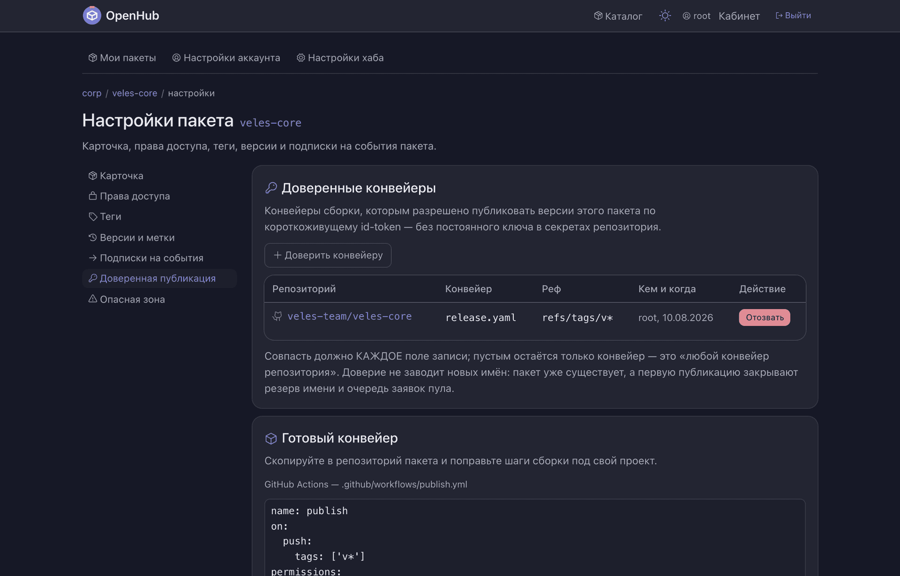

# Публикация

Как пакет попадает в пул. Путей четыре, и каталоги названы ими: прямой push ключом или
из браузера; заявка во входящих, когда права на пул нет; доверенный конвейер CI, который
публикует без человека; раздача прав по факту доступа к GitHub-репозиторию.

| Каталог | Что внутри | Где видно |
| --- | --- | --- |
| `push/` | приём публикации: контроллер маршрута, оркестровка приёма — рамки ключа, право, проверка `.ospx`, — расчёт «влезет ли в пул», резервирование имени пакета | `POST /push` · `POST /api/v1/pools/{пул}/push` |
| `входящие/` | очередь заявок, когда права на пул нет: сама очередь и решение по заявке — кому она видна, кто вправе решать | `/api/v1/inbox` · `…/pools/{пул}/inbox/{заявка}/approve` · настройки пула, раздел «Входящие» |
| `доверие/запись/` | что администратор объявил доверенным: запись о конвейере, маска рефа, короткие формы записи, проверка адреса издателя | настройки пакета, раздел «Доверенная публикация» · `…/trusted-workflows` |
| `доверие/токен/` | проверка id-token конвейера: подпись по JWKS, транспорт и кэш ключей по издателям, аудитория и срок токена | внутри пути push |
| `github/` | раздача прав по факту доступа на запись в репозиторий: список репозиториев и одна раздача, снятая с потока входа | срабатывает при входе через провайдера |

*Совпасть должно каждое поле записи; пустым остаётся только имя конвейера.*

Своих версий модуль не заводит: он проверяет право и отдаёт заявку в `реестр`, а байты
`.ospx` кладёт `хранилище`. Об исходе заявки заявителю рассказывает `связь`. Адрес издателя
проверяет та же защита исходящих адресов, что и у подписок: в хабе она одна. Расчётом места
в пуле пользуется и `зеркала` — второй путь в пул считает по тем же правилам, что и push.

Куда именно попадает пакет и чем один пул отличается от другого — [корневой
README](../../../README.md).
